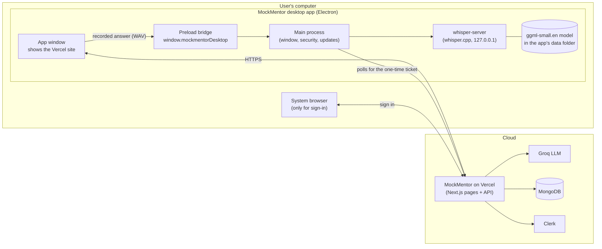
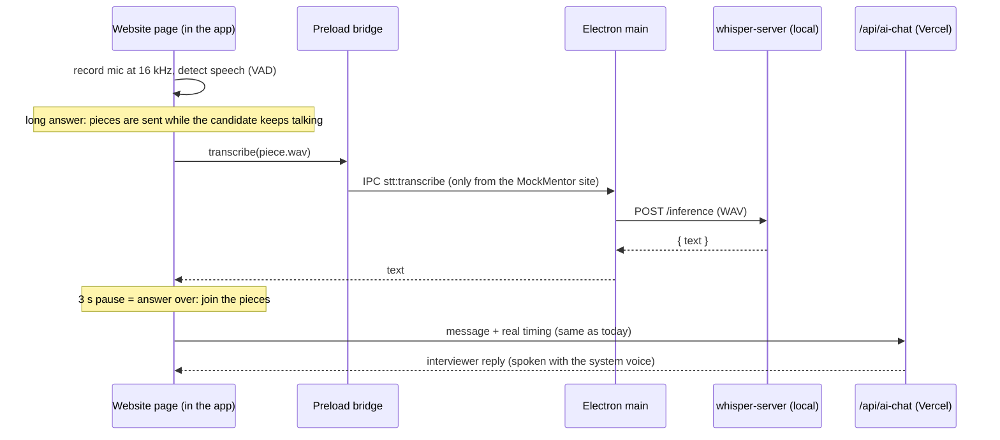
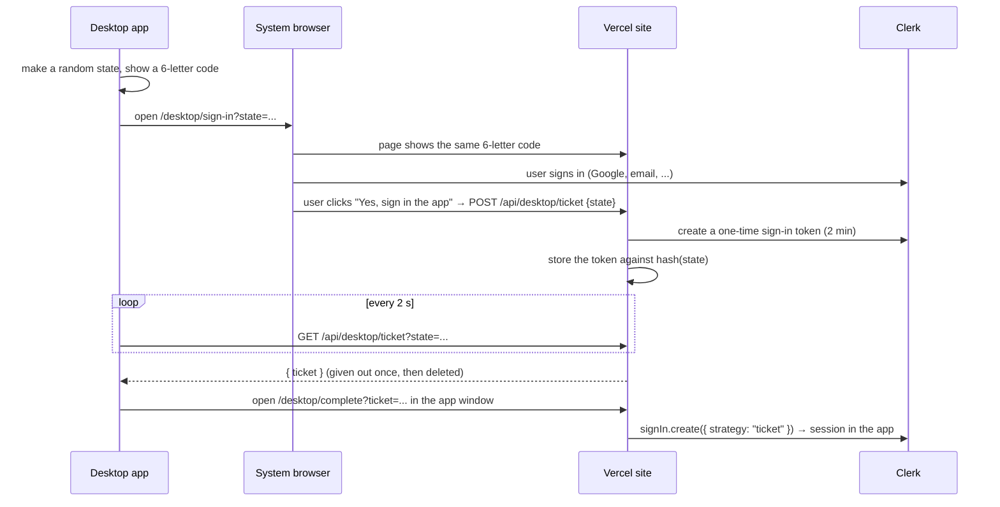

# MockMentor desktop app: build plan for Windows and Linux

> **Status:** plan only. Nothing in the app has changed yet. Written 2026-09-30.
> **Who it's for:** you, or anyone you hand it to. It's written so you can build it alone, phase by phase, without asking anyone.
> **Where the code comes from:** every code and config block below was checked while writing this plan (see [What was checked](#what-was-checked-while-writing-this-plan)). They're starting points, not finished, tested features. Each phase says how to prove it works.

---

## Contents

1. [The decisions this plan is built on](#1-the-decisions-this-plan-is-built-on)
2. [How it works](#2-how-it-works)
3. [Before you start: tools and accounts](#3-before-you-start-tools-and-accounts)
4. [What the repository will look like](#4-what-the-repository-will-look-like)
5. [Phase 0: measure Whisper, and try Electron on real PCs (about 1 day)](#5-phase-0-measure-whisper-and-try-electron-on-real-pcs)
6. [Phase 1: changes to the website (3 to 4 days)](#6-phase-1-changes-to-the-website)
7. [Phase 2: the Electron app (3 to 4 days)](#7-phase-2-the-electron-app)
8. [Phase 3: installers, releases and downloads (about 2 days)](#8-phase-3-installers-releases-and-downloads)
9. [Testing: automated and by hand](#9-testing-automated-and-by-hand)
10. [Troubleshooting](#10-troubleshooting)
11. [Risks and how the plan handles them](#11-risks-and-how-the-plan-handles-them)
12. [Effort and cost](#12-effort-and-cost)
13. [Still to decide](#13-still-to-decide)
14. [What was checked while writing this plan](#what-was-checked-while-writing-this-plan)
15. [Progress checklist](#progress-checklist)

---

## 1. The decisions this plan is built on

| Topic | Decision | Consequence |
|---|---|---|
| Hosting | The website stays on **Vercel** | The desktop app shows the Vercel site in its own window. The server's secrets (MongoDB, Groq, Clerk, Appwrite keys) never leave Vercel |
| Approach | **Electron**, built straight away | One bundled Chromium, so Windows and Linux behave the same, and it's the same engine the website was tested on |
| Speech-to-text | OpenAI's **Whisper `small.en`**, run **on the user's computer** with **whisper.cpp** | Audio never leaves the computer. There's no per-use cost. It's needed because Electron lacks the speech service Chrome and Edge use |
| Windows | **Unsigned** installer at first | Windows shows "Windows protected your PC". The user clicks **More info → Run anyway**. Sign it later |
| Linux | **AppImage** (any distribution) + **.rpm** (Fedora, openSUSE, RHEL) | No `.deb`. Ubuntu users use the AppImage; see the Ubuntu notes in [Troubleshooting](#10-troubleshooting) |
| Sign-in | The app **opens the system browser**, the user signs in there, and the app is signed in automatically | Google sign-in works, because Google blocks its sign-in page inside app windows |

**Why the server can't be inside the app:** anything in an installer can be unpacked. If the Next.js server ran on the user's computer, it would need your MongoDB, Groq, Clerk and Appwrite keys, and anyone could copy them. So the app is a secure window onto the hosted site, like the Slack, Discord and Notion desktop apps. A bonus: when you deploy a fix to Vercel, desktop users get it immediately, with no new installer.

**Why speech needs Whisper:**
- In Chrome, `SpeechRecognition` sends audio to Google. In Edge, it goes to Microsoft.
- Electron embeds open-source Chromium, which doesn't include those services. A check while writing this plan: open-source Chromium exposes the API, but starting it produced no events at all.
- Whisper replaces it. It runs locally, so recognition works offline once the model is downloaded, and audio stays private.

---

## 2. How it works

### The pieces



### One spoken answer, start to finish



### Signing in through the browser



The 6-letter code is a security step, not decoration. Without it, an attacker could send someone a sign-in link carrying the attacker's own `state`. If the victim signed in and approved it, the attacker's copy of the app would receive the victim's session. With the code, the victim only approves when the browser shows the same code as their own app.

---

## 3. Before you start: tools and accounts

### On your development machine
| Tool | Why | Windows | Linux |
|---|---|---|---|
| Node.js 22 or 24 + npm | Website and Electron | nodejs.org installer | distro package or nvm |
| Git | Everything | git-scm.com | distro package |
| CMake 3.20+ | Building whisper.cpp | cmake.org, or `winget install Kitware.CMake` | `sudo dnf install cmake` / `sudo apt install cmake` |
| C/C++ compiler | Building whisper.cpp | Visual Studio 2022 **Build Tools** with the "Desktop development with C++" workload | `gcc gcc-c++` (Fedora) / `build-essential` (Ubuntu) |
| Git Bash | Runs `scripts/build-whisper.sh` on Windows | comes with Git for Windows | — |
| `rpm` tools | Building the `.rpm` on a non-Fedora machine | — | `sudo apt install rpm` (Ubuntu) |

### Machines to test on
- One **Windows 10 or 11** PC.
- One **Fedora** machine (tests the `.rpm`).
- One **Ubuntu 24.04** machine (tests the AppImage and the sandbox issue in [Troubleshooting](#10-troubleshooting)).
- Virtual machines are fine for everything except camera and microphone quality. Pass a real camera and mic through, or use a spare laptop.

### Accounts and settings
- **GitHub:** the repository, Actions (free for public repos) and Releases, where the installers and auto-updates live.
- **Vercel:** the site's **exact URL** (see [Still to decide](#13-still-to-decide)).
- **Clerk:**
  - On a `*.vercel.app` address, Clerk can only run as a **development** instance, which is fine for building and testing.
  - A public release needs a **custom domain** and a Clerk **production** instance.
  - "Sign-in tokens" are part of Clerk's backend API and need no dashboard switch. Check that the sign-in methods you want (Google, email) are enabled.

---

## 4. What the repository will look like

New files are marked `+`; changed files are marked `~`.

```text
MockMentor/
├── app/
│   ├── api/desktop/ticket/route.ts        + one-time sign-in ticket (create / collect)
│   └── desktop/
│       ├── sign-in/page.tsx               + opened in the system browser
│       └── complete/page.tsx              + opened in the app window with the ticket
├── components/
│   ├── navbar.tsx                         ~ "Sign in" uses the browser flow inside the app
│   └── interview.tsx                      ~ prepares the speech model before the first answer
├── hooks/
│   ├── useSpeechToText.ts                 ~ picks the engine: browser or local Whisper
│   └── useLocalSpeechToText.ts            + records, detects speech, calls local Whisper
├── lib/
│   ├── desktopBridge.ts                   + types for window.mockmentorDesktop
│   ├── desktopCode.ts                     + the 6-letter confirmation code
│   ├── audio/vad.ts (+ vad.test.ts)       + speech detection (pure, unit-tested)
│   ├── audio/wav.ts                       + 16 kHz mono WAV encoder
│   ├── models/DesktopSignIn.ts            + pending tickets (auto-deleted after 2 min)
│   └── rateLimit.ts                       ~ (uses the existing Limit type; no change needed)
├── public/audio/pcm-capture-worklet.js    + audio-thread microphone capture
├── middleware.ts                          ~ /desktop/* and /api/desktop/* are public
├── desktop/                               + the Electron app (its own package.json)
│   ├── package.json
│   ├── electron-builder.yml
│   ├── build/icon.png                     + 512×512 app icon (you provide)
│   ├── scripts/build-whisper.sh           + builds whisper.cpp for this OS
│   ├── vendor/whisper/{win,linux}/        (generated; gitignored)
│   └── src/
│       ├── main.js  preload.js  config.js
│       ├── whisper.js  model.js  auth.js  updates.js
│       └── offline.html
└── .github/workflows/
    ├── whisper-benchmark.yml              + Phase 0
    └── desktop-release.yml                + Phase 3
```

Add to `.gitignore`:
```gitignore
desktop/node_modules/
desktop/dist/
desktop/vendor/
desktop/.whisper-build/
```

Add `'desktop/**'` to the `ignores` list in `eslint.config.mjs`. Otherwise the website's `npm run lint` checks the Electron app's CommonJS files (`require(...)` is an error under the Next.js rules) and everything electron-builder writes to `desktop/dist/`.

**Why a separate `desktop/` package:** Electron and electron-builder are large. Keeping them out of the website's `package.json` means Vercel builds and the website's CI don't change.

---

## 5. Phase 0: measure Whisper, and try Electron on real PCs

**Goal:** before building anything, find out:
1. how fast Whisper `small.en` is on an ordinary 4-core machine;
2. whether camera, microphone, voices and face tracking work in an Electron window on your Windows and Linux PCs.

### 5.1 The benchmark workflow

Save as `.github/workflows/whisper-benchmark.yml`, push, then open **Actions → Whisper benchmark → Run workflow**.

```yaml
name: Whisper benchmark

# Phase 0: how long does local Whisper take on an ordinary 4-core machine? Run it by hand from the
# Actions tab. Prints timings for each model and clip length, and the SHA-256 of each model file.
on:
  workflow_dispatch:

jobs:
  bench:
    strategy:
      fail-fast: false
      matrix:
        os: [ubuntu-latest, windows-latest]
    runs-on: ${{ matrix.os }}
    defaults:
      run:
        shell: bash
    steps:
      - name: Build whisper-cli (portable CPU build)
        run: |
          git clone --depth 1 https://github.com/ggml-org/whisper.cpp.git
          cmake -S whisper.cpp -B build -DCMAKE_BUILD_TYPE=Release -DBUILD_SHARED_LIBS=ON \
            -DGGML_NATIVE=OFF -DGGML_BACKEND_DL=ON -DGGML_CPU_ALL_VARIANTS=ON -DWHISPER_BUILD_TESTS=OFF
          cmake --build build --config Release -j 4 --target whisper-cli
          echo "CLI=$(find build -name 'whisper-cli' -o -name 'whisper-cli.exe' | head -1)" >> "$GITHUB_ENV"

      - name: Download models (and print their SHA-256 to pin in desktop/src/config.js)
        run: |
          for m in ggml-small.en-q5_1.bin ggml-small.en.bin ggml-base.en.bin; do
            curl -sSL --retry 3 -o "$m" "https://huggingface.co/ggerganov/whisper.cpp/resolve/main/$m"
            echo "$m $(du -h "$m" | cut -f1) sha256=$( (sha256sum "$m" 2>/dev/null || certutil -hashfile "$m" SHA256) | head -2 | tail -1 | awk '{print $1}')"
          done

      - name: Make 10 s / 30 s / 60 s test clips from the bundled sample
        run: |
          python - <<'PY'
          import wave
          with wave.open('whisper.cpp/samples/jfk.wav') as w:
              params, frames = w.getparams(), w.readframes(w.getnframes())
          seconds = len(frames) / (params.sampwidth * params.framerate)
          for target in (10, 30, 60):
              copies = max(1, round(target / seconds))
              with wave.open(f'clip{target}.wav', 'wb') as out:
                  out.setparams(params)
                  out.writeframes(frames * copies)
          PY

      - name: Time each model on each clip (4 threads)
        run: |
          for m in ggml-small.en-q5_1.bin ggml-small.en.bin ggml-base.en.bin; do
            for c in 10 30 60; do
              start=$(date +%s.%N)
              "$CLI" -m "$m" -f "clip$c.wav" -t 4 -l en -nt > /dev/null 2>&1
              end=$(date +%s.%N)
              echo "$m clip=${c}s time=$(python -c "print(round($end - $start, 2))")s" | tee -a results.txt
            done
          done
          echo '## Results (${{ matrix.os }})' >> "$GITHUB_STEP_SUMMARY"
          sed 's/^/    /' results.txt >> "$GITHUB_STEP_SUMMARY"
```

**How to read the results** (in the run's summary page):

- **The wait users feel** is roughly the time for the *last piece* of an answer. Pieces of about 8 s are sent while the candidate is still talking, so look at the **10 s clip** time.
- **Rules of thumb:**
  - **`small.en-q5_1` on 10 s ≤ 2 s:** use it as the default. It's about 180 MB, and quality is very close to the full model.
  - **Between 2 and 4 s:** still usable. Add a "Faster (less accurate)" setting that switches to `base.en`.
  - **Over 4 s:** make `base.en` the default and offer `small.en` as "More accurate".
- **Copy the printed SHA-256** of the model you choose into `desktop/src/config.js` (`MODEL.sha256`). The app refuses a downloaded file that doesn't match.

### 5.2 The Electron spike (half a day)

Make a throwaway folder, run `npm init -y && npm i -D electron`, and add this `main.js`:

```js
const { app, BrowserWindow, session } = require('electron');
app.whenReady().then(() => {
  session.defaultSession.setPermissionRequestHandler((_wc, _p, cb) => cb(true)); // spike only!
  const win = new BrowserWindow({ width: 1280, height: 860 });
  win.loadURL(process.env.SITE || 'https://YOUR-APP.vercel.app/emotion-demo');
  win.webContents.openDevTools({ mode: 'detach' });
});
```

Run `npx electron .` on each test machine and fill in this table (keep it in `tasks/todo.md`):

| Check | How | Windows | Fedora | Ubuntu 24.04 |
|---|---|---|---|---|
| Window opens | — | | | |
| Camera + emotion model | `/emotion-demo` → Turn on camera → badge says "Model running" | | | |
| Voices available | DevTools console: `speechSynthesis.getVoices().length` | | | |
| Speech recognition (expected to fail) | Console: `r=new webkitSpeechRecognition();r.onerror=e=>console.log(e.error);r.start()` | | | |
| Mic capture | Console: `navigator.mediaDevices.getUserMedia({audio:true}).then(()=>'ok')` | | | |
| Guest interview works (type answers) | `/interview/new` → Try as Guest | | | |
| Memory with Whisper running | Task Manager / `top` during a transcription | | | |

**Done when:** the benchmark numbers are known, the model and SHA-256 are chosen, and the table is filled in. If Ubuntu 24.04 won't start Electron (a "SUID sandbox" error), read [Troubleshooting](#10-troubleshooting) before going further.

---

## 6. Phase 1: changes to the website

Everything here deploys to Vercel as usual. **Nothing changes for normal browser users.** Each new code path only runs when `window.mockmentorDesktop` exists, which only happens inside the app.

### 6.1 The desktop bridge types: `lib/desktopBridge.ts`

```ts
// What the MockMentor desktop app's preload exposes (desktop/src/preload.js). Absent in browsers.
export interface MockMentorDesktop {
  isDesktop: true;
  info(): Promise<{ version: string; platform: string }>;
  transcribe(wav: ArrayBuffer): Promise<{ text: string }>;
  modelStatus(): Promise<{ ready: boolean; file: string }>;
  ensureModel(): Promise<{ ready: boolean }>;
  onModelProgress(callback: (progress: { received: number; total: number }) => void): () => void;
  signIn(): Promise<{ signedIn: boolean }>;
}

declare global {
  interface Window {
    mockmentorDesktop?: MockMentorDesktop;
  }
}

export function desktopBridge(): MockMentorDesktop | undefined {
  return typeof window === 'undefined' ? undefined : window.mockmentorDesktop;
}

export const isDesktopApp = () => Boolean(desktopBridge());
```

### 6.2 WAV encoding: `lib/audio/wav.ts`

whisper.cpp reads 16-bit PCM WAV directly, so no ffmpeg is needed.

```ts
// Mono 16-bit PCM WAV from float samples in [-1, 1]. whisper.cpp reads this directly (no ffmpeg).
export function encodeWav(samples: Float32Array, sampleRate = 16000): Uint8Array {
  const bytesPerSample = 2;
  const dataBytes = samples.length * bytesPerSample;
  const buffer = new ArrayBuffer(44 + dataBytes);
  const view = new DataView(buffer);
  const writeText = (offset: number, text: string) => {
    for (let i = 0; i < text.length; i++) view.setUint8(offset + i, text.charCodeAt(i));
  };
  writeText(0, 'RIFF');
  view.setUint32(4, 36 + dataBytes, true);
  writeText(8, 'WAVE');
  writeText(12, 'fmt ');
  view.setUint32(16, 16, true);             // fmt chunk size
  view.setUint16(20, 1, true);              // PCM
  view.setUint16(22, 1, true);              // mono
  view.setUint32(24, sampleRate, true);
  view.setUint32(28, sampleRate * bytesPerSample, true); // byte rate
  view.setUint16(32, bytesPerSample, true); // block align
  view.setUint16(34, 16, true);             // bits per sample
  writeText(36, 'data');
  view.setUint32(40, dataBytes, true);
  for (let i = 0; i < samples.length; i++) {
    const s = Math.max(-1, Math.min(1, samples[i]));
    view.setInt16(44 + i * 2, s < 0 ? s * 0x8000 : s * 0x7fff, true);
  }
  return new Uint8Array(buffer);
}
```

### 6.3 Speech detection: `lib/audio/vad.ts`

It decides when speech starts, when a long answer can be cut into a piece, and when the answer is over. It keeps today's rules: a 3 s pause ends an answer, and 10 s of total silence gets a check-in. It's pure, so it's unit-tested without a browser.

```ts
// Voice activity detection from per-frame loudness. Pure: feed it one frame's level at a time and
// it reports when speech starts, when a background chunk can be cut, and when the answer is over.

export interface VadOptions {
  frameMs: number;        // length of one frame (20 ms at 16 kHz = 320 samples)
  silenceMs: number;      // pause that ends an answer (the app uses 3000)
  totalSilenceMs: number; // nothing said at all since listening began (the app uses 10000)
  minSpeechMs: number;    // this much loud audio in a row counts as speech (ignores clicks)
  chunkAfterMs: number;   // once a piece is this long, cut it at the next short pause...
  chunkPauseMs: number;   // ...of at least this long, and transcribe it in the background
  marginDb: number;       // how far above the noise floor counts as speech
  minSpeechDb: number;    // never treat anything quieter than this as speech
  calibrateMs: number;    // at start-up, only learn the room's background level for this long
}

export const DEFAULT_VAD: VadOptions = {
  frameMs: 20, silenceMs: 3000, totalSilenceMs: 10000, minSpeechMs: 150,
  chunkAfterMs: 8000, chunkPauseMs: 400, marginDb: 12, minSpeechDb: -50, calibrateMs: 500,
};

export type VadEvent =
  | { type: 'speech-start'; atMs: number }
  | { type: 'chunk'; fromMs: number; toMs: number }
  | { type: 'answer-end'; fromMs: number; toMs: number; speechStartMs: number; lastSpeechMs: number }
  | { type: 'total-silence' };

export function rmsDb(frame: Float32Array): number {
  let sum = 0;
  for (let i = 0; i < frame.length; i++) sum += frame[i] * frame[i];
  const rms = Math.sqrt(sum / Math.max(1, frame.length));
  return 20 * Math.log10(rms + 1e-10);
}

export function createVad(options: Partial<VadOptions> = {}) {
  const o = { ...DEFAULT_VAD, ...options };
  let now = 0;                 // ms since listening began
  let noiseDb = -60;           // running estimate of the room's background level
  let loudRunMs = 0;           // consecutive loud audio, for the onset check
  let quietRunMs = 0;          // consecutive quiet audio while in speech
  let inSpeech = false;
  let speechStartMs = -1;      // first speech of this answer
  let lastSpeechMs = -1;       // end of the latest loud frame
  let pieceStartMs = 0;        // start of the audio not yet sent for transcription
  let totalSilenceFired = false;
  let calibratedMs = 0;        // start-up calibration; kept across turns (the room doesn't change)
  let calibrationSum = 0;

  return {
    push(levelDb: number): VadEvent[] {
      const events: VadEvent[] = [];
      now += o.frameMs;
      if (calibratedMs < o.calibrateMs) {
        // Learn the background level first; otherwise steady noise (a fan, a hum) that's above
        // the initial guess would count as speech before the estimate catches up.
        calibratedMs += o.frameMs;
        calibrationSum += levelDb;
        noiseDb = calibrationSum / (calibratedMs / o.frameMs);
        return events;
      }
      const loud = levelDb > Math.max(noiseDb + o.marginDb, o.minSpeechDb);
      if (!loud && !inSpeech) noiseDb = 0.95 * noiseDb + 0.05 * levelDb; // adapt only to non-speech

      if (loud) {
        loudRunMs += o.frameMs;
        quietRunMs = 0;
        if (!inSpeech && loudRunMs >= o.minSpeechMs) {
          inSpeech = true;
          const start = now - loudRunMs;
          if (speechStartMs < 0) {
            speechStartMs = start;
            pieceStartMs = Math.max(0, start - 300); // keep a little lead-in
            events.push({ type: 'speech-start', atMs: start });
          }
        }
        if (inSpeech) lastSpeechMs = now;
      } else {
        loudRunMs = 0;
        if (inSpeech) {
          quietRunMs += o.frameMs;
          // Long piece + short pause: send what we have while the candidate keeps talking.
          if (quietRunMs === o.chunkPauseMs && lastSpeechMs - pieceStartMs >= o.chunkAfterMs) {
            events.push({ type: 'chunk', fromMs: pieceStartMs, toMs: now });
            pieceStartMs = now;
          }
          if (quietRunMs >= o.silenceMs) {
            events.push({ type: 'answer-end', fromMs: pieceStartMs, toMs: lastSpeechMs + 300, speechStartMs, lastSpeechMs });
            inSpeech = false;
            speechStartMs = -1;
            pieceStartMs = now;
            quietRunMs = 0;
          }
        }
      }

      if (speechStartMs < 0 && !inSpeech && !totalSilenceFired && now >= o.totalSilenceMs && lastSpeechMs < 0) {
        totalSilenceFired = true;
        events.push({ type: 'total-silence' });
      }
      return events;
    },
    // A new listening turn: timing restarts, the learned noise floor is kept.
    reset() {
      now = 0; loudRunMs = 0; quietRunMs = 0; inSpeech = false;
      speechStartMs = -1; lastSpeechMs = -1; pieceStartMs = 0; totalSilenceFired = false;
    },
  };
}
```

**Tests:** `lib/audio/vad.test.ts`. These already pass: 5/5. The fan-noise test caught a real bug while writing this plan, which the calibration step fixes.

```ts
import assert from 'node:assert/strict';
import { test } from 'node:test';
import { createVad, rmsDb, type VadEvent } from './vad.ts';
import { encodeWav } from './wav.ts';

const QUIET = -65, LOUD = -25; // dBFS
function run(levels: Array<[number, number]>) { // [levelDb, durationMs]
  const vad = createVad();
  const events: Array<VadEvent & { at: number }> = [];
  let t = 0;
  for (const [db, ms] of levels) for (let i = 0; i < ms / 20; i++) { t += 20; for (const e of vad.push(db)) events.push({ ...e, at: t }); }
  return events;
}

test('one answer: speech start, then answer end after a 3 s pause', () => {
  const ev = run([[QUIET, 1000], [LOUD, 4000], [QUIET, 3200]]);
  assert.deepEqual(ev.map((e) => e.type), ['speech-start', 'answer-end']);
  const end = ev[1] as Extract<VadEvent, { type: 'answer-end' }>;
  assert.equal(end.speechStartMs, 1000);
  assert.equal(end.lastSpeechMs, 5000);
});

test('short pauses inside an answer do not end it; a long answer is cut into chunks', () => {
  const ev = run([[QUIET, 500], [LOUD, 9000], [QUIET, 600], [LOUD, 3000], [QUIET, 3100]]);
  assert.deepEqual(ev.map((e) => e.type), ['speech-start', 'chunk', 'answer-end']);
});

test('clicks shorter than minSpeechMs are ignored; total silence fires once at 10 s', () => {
  const ev = run([[QUIET, 2000], [LOUD, 60], [QUIET, 9000]]);
  assert.deepEqual(ev.map((e) => e.type), ['total-silence']);
  assert.equal(ev[0].at, 10000);
});

test('noise floor adapts: a steady fan is not speech', () => {
  const ev = run([[-45, 12000]]); // constant moderate noise
  assert.ok(!ev.some((e) => e.type === 'speech-start'));
});

test('rmsDb and encodeWav', () => {
  assert.ok(Math.abs(rmsDb(new Float32Array(320).fill(0.1)) - -20) < 0.01);
  const wav = encodeWav(new Float32Array([0, 1, -1]), 16000);
  const v = new DataView(wav.buffer);
  assert.equal(String.fromCharCode(...wav.slice(0, 4)), 'RIFF');
  assert.equal(v.getUint32(24, true), 16000);
  assert.equal(v.getUint32(40, true), 6);
  assert.equal(v.getInt16(46, true), 32767);
  assert.equal(v.getInt16(48, true), -32768);
});
```

Put it in `lib/audio/`, next to `vad.ts` and `wav.ts`; its imports already point there. The website's `npm test` (`node --test`) picks it up automatically.

**Tuning notes:**
- `marginDb: 12` means speech must be 12 dB above the room's background level.
- In a noisy room, raise it to 15. For quiet speakers, lower it to 9.
- Test with a real laptop microphone, with a fan on and off.

### 6.4 Microphone capture on the audio thread: `public/audio/pcm-capture-worklet.js`

```js
// Runs on the audio thread: forwards each 128-sample block of microphone audio to the page.
// The AudioContext runs at 16 kHz, so blocks arrive already resampled for Whisper.
class PcmCapture extends AudioWorkletProcessor {
  process(inputs) {
    const channel = inputs[0] && inputs[0][0];
    if (channel) this.port.postMessage(channel.slice(0));
    return true; // keep running
  }
}
registerProcessor('pcm-capture', PcmCapture);
```

### 6.5 The local speech engine: `hooks/useLocalSpeechToText.ts`

It has the same return values and the same `onSilenceTimeout(text, { durationMs, pauseBefore })` callback as today's `useSpeechToText`. So `useVoiceInterview`, the silence nudge, the timing metrics and the reports all work unchanged.

```ts
'use client';

// Speech-to-text for the desktop app: records the microphone, finds where each answer starts and
// ends, and has the app transcribe it with local Whisper. Same interface as useSpeechToText, so
// useVoiceInterview doesn't need to know which engine is running.
import { useCallback, useEffect, useRef, useState } from 'react';
import { createVad, rmsDb, type VadEvent } from '@/lib/audio/vad';
import { encodeWav } from '@/lib/audio/wav';
import { desktopBridge } from '@/lib/desktopBridge';

export interface SpeechTimingMeta {
  durationMs: number;
  pauseBefore: number;
}

interface Options {
  onSilenceTimeout?: (finalTranscript: string, meta: SpeechTimingMeta) => void;
  silenceTimeoutMs?: number;
  totalSilenceTimeoutMs?: number;
}

const SAMPLE_RATE = 16000;
const FRAME_SAMPLES = 320;              // 20 ms
const MAX_ANSWER_MS = 90_000;           // hard cap on one answer's audio kept in memory

type Audio = { ctx: AudioContext; stream: MediaStream; node: AudioWorkletNode };

export function useLocalSpeechToText(options?: Options) {
  const [isListening, setIsListening] = useState(false);
  const [transcript, setTranscript] = useState('');
  const [interimTranscript, setInterimTranscript] = useState('');
  const [error, setError] = useState<string | null>(null);

  const onSilenceRef = useRef(options?.onSilenceTimeout);
  useEffect(() => {
    onSilenceRef.current = options?.onSilenceTimeout;
  }, [options?.onSilenceTimeout]);

  const silenceMs = options?.silenceTimeoutMs ?? 3000;
  const totalSilenceMs = options?.totalSilenceTimeoutMs ?? 10000;

  const audioRef = useRef<Audio | null>(null);
  const vadRef = useRef(createVad({ silenceMs, totalSilenceMs }));
  const listeningRef = useRef(false);
  const turnRef = useRef(0);                 // bumps on every start/stop, so late results are dropped
  const framesRef = useRef<Float32Array[]>([]); // this turn's audio, one 20 ms frame per entry
  const partialRef = useRef(new Float32Array(FRAME_SAMPLES));
  const partialFillRef = useRef(0);
  const piecesRef = useRef<Promise<string>[]>([]);   // transcriptions in progress, in order

  const slice = (fromMs: number, toMs: number): Float32Array => {
    const frames = framesRef.current.slice(Math.floor(fromMs / 20), Math.ceil(toMs / 20));
    const out = new Float32Array(frames.length * FRAME_SAMPLES);
    frames.forEach((f, i) => out.set(f, i * FRAME_SAMPLES));
    return out;
  };

  const transcribePiece = useCallback((audio: Float32Array): Promise<string> => {
    const bridge = desktopBridge();
    if (!bridge || audio.length === 0) return Promise.resolve('');
    const wav = encodeWav(audio, SAMPLE_RATE);
    return bridge
      .transcribe(wav.buffer.slice(wav.byteOffset, wav.byteOffset + wav.byteLength) as ArrayBuffer)
      .then((r) => r.text)
      .catch((err) => {
        console.error('Local transcription failed:', err);
        setError('Speech recognition failed for that answer. You can type it instead.');
        return '';
      });
  }, []);

  const handleEvent = useCallback((event: VadEvent) => {
    const turn = turnRef.current;
    if (event.type === 'chunk') {
      const piece = transcribePiece(slice(event.fromMs, event.toMs));
      piecesRef.current.push(piece);
      // Show finished pieces while the candidate is still talking.
      Promise.all(piecesRef.current).then((texts) => {
        if (turn === turnRef.current) setInterimTranscript(`${texts.join(' ').trim()} …`);
      });
    } else if (event.type === 'answer-end') {
      piecesRef.current.push(transcribePiece(slice(event.fromMs, event.toMs)));
      const pieces = piecesRef.current;
      piecesRef.current = [];
      Promise.all(pieces).then((texts) => {
        if (turn !== turnRef.current) return; // stopped meanwhile (muted, paused, interview over)
        const text = texts.join(' ').replace(/\s+/g, ' ').trim();
        setTranscript(text);
        setInterimTranscript('');
        framesRef.current = [];
        if (text) {
          onSilenceRef.current?.(text, {
            durationMs: event.lastSpeechMs - event.speechStartMs,
            pauseBefore: event.speechStartMs,
          });
        }
      });
    } else if (event.type === 'total-silence') {
      onSilenceRef.current?.('', { durationMs: 0, pauseBefore: totalSilenceMs });
    }
  }, [transcribePiece, totalSilenceMs]);

  // Called for every block from the worklet: regroup into 20 ms frames and run the detector.
  const onBlock = useCallback((block: Float32Array) => {
    if (!listeningRef.current) return;
    let offset = 0;
    while (offset < block.length) {
      const take = Math.min(FRAME_SAMPLES - partialFillRef.current, block.length - offset);
      partialRef.current.set(block.subarray(offset, offset + take), partialFillRef.current);
      partialFillRef.current += take;
      offset += take;
      if (partialFillRef.current === FRAME_SAMPLES) {
        const frame = partialRef.current.slice();
        partialFillRef.current = 0;
        if (framesRef.current.length < MAX_ANSWER_MS / 20) framesRef.current.push(frame);
        for (const event of vadRef.current.push(rmsDb(frame))) handleEvent(event);
      }
    }
  }, [handleEvent]);

  const ensureAudio = useCallback(async (): Promise<Audio> => {
    if (audioRef.current) return audioRef.current;
    const stream = await navigator.mediaDevices.getUserMedia({
      audio: { channelCount: 1, echoCancellation: true, noiseSuppression: true, autoGainControl: true },
    });
    const ctx = new AudioContext({ sampleRate: SAMPLE_RATE });
    await ctx.audioWorklet.addModule('/audio/pcm-capture-worklet.js');
    const node = new AudioWorkletNode(ctx, 'pcm-capture');
    node.port.onmessage = (e: MessageEvent<Float32Array>) => onBlock(e.data);
    ctx.createMediaStreamSource(stream).connect(node);
    node.connect(ctx.destination); // pulls the graph; the processor outputs silence
    audioRef.current = { ctx, stream, node };
    return audioRef.current;
  }, [onBlock]);

  const startListening = useCallback(() => {
    turnRef.current += 1;
    framesRef.current = [];
    piecesRef.current = [];
    partialFillRef.current = 0;
    vadRef.current.reset();
    setTranscript('');
    setInterimTranscript('');
    setError(null);
    ensureAudio()
      .then(async ({ ctx }) => {
        if (ctx.state === 'suspended') await ctx.resume();
        listeningRef.current = true;
        setIsListening(true);
      })
      .catch((err: unknown) => {
        const name = (err as { name?: string })?.name;
        setError(name === 'NotAllowedError'
          ? 'Microphone access denied. Please enable it in your system settings.'
          : 'No microphone found or microphone not working. Please check your device.');
      });
  }, [ensureAudio]);

  const stopListening = useCallback(() => {
    turnRef.current += 1; // results still in flight for this turn are dropped
    listeningRef.current = false;
    framesRef.current = [];
    piecesRef.current = [];
    setIsListening(false);
    setInterimTranscript('');
  }, []);

  const clearTranscript = useCallback(() => {
    setTranscript('');
    setInterimTranscript('');
  }, []);

  useEffect(() => () => {
    listeningRef.current = false;
    const audio = audioRef.current;
    audio?.stream.getTracks().forEach((t) => t.stop());
    audio?.ctx.close();
    audioRef.current = null;
  }, []);

  return {
    isListening,
    transcript,
    interimTranscript,
    error,
    isSupported: true,
    startListening,
    stopListening,
    clearTranscript,
  };
}
```

**How it behaves:**
- The microphone opens once and stays open. Audio is only processed while listening.
- Muting, pausing and the interviewer speaking all call `stopListening()`, as today.
- Results that arrive after a stop are dropped, using the `turnRef` counter.
- While a long answer is still being spoken, finished pieces appear in the interim transcript overlay, with "…".
- If a transcription fails, the candidate sees a message and can type the answer instead.

### 6.6 Picking the engine: `hooks/useSpeechToText.ts`

Rename the existing hook `useBrowserSpeechToText`, and add at the bottom:

```ts
import { useLocalSpeechToText } from './useLocalSpeechToText';

// Inside the desktop app, speech is recognized by local Whisper; in browsers, by the browser.
// Chosen once per page load (the bridge never appears or disappears while the page is open).
export const useSpeechToText: typeof useBrowserSpeechToText =
  typeof window !== 'undefined' && window.mockmentorDesktop ? useLocalSpeechToText : useBrowserSpeechToText;
```

Also move `SpeechTimingMeta` into one shared place (for example `lib/speechTypes.ts`), so both hooks import the same type.

### 6.7 Getting the model ready before the first answer: `components/interview.tsx`

- **On the setup page:** when the page loads in the app, start the download in the background, so it's usually finished before the interview.
  ```ts
  useEffect(() => { desktopBridge()?.ensureModel().catch(() => {}); }, []);
  ```
- **In `handleStartSession`:** before calling `start(interviewId)`, wait for the model if it isn't ready, and show progress.
  ```ts
  const bridge = desktopBridge();
  if (bridge && !(await bridge.modelStatus()).ready) {
    setPreparing(0); // show "Preparing speech recognition (first time only) — 0%"
    const off = bridge.onModelProgress(({ received, total }) =>
      setPreparing(total ? Math.round((received / total) * 100) : null));
    try {
      await bridge.ensureModel();
    } catch {
      setStartError('Could not download the speech model. Check your connection and try again. You can also type your answers.');
      return;
    } finally {
      off();
      setPreparing(null);
    }
  }
  ```
  Render the `preparing` percentage where the "Starting..." text is today.

### 6.8 Captions when the computer has no voices

- **Why:** Linux machines without `speech-dispatcher` have no voices. The interviewer is then silent, although the app doesn't get stuck (`speak()` fails at once, and the flow carries on).
- **In `hooks/useTextToSpeech.ts`:** expose `hasVoices`, meaning `voices.length > 0` about 1 second after load (voices load asynchronously).
- **In `components/interview.tsx`:** when `!hasVoices`, or the user turns on "Captions", do two things:
  - show the interviewer's latest message as a large caption over the interviewer panel;
  - open the transcript panel automatically.
- **Accessibility:** the "Captions" toggle helps deaf and hard-of-hearing users too. Keep it available everywhere, not only in the app.

### 6.9 Sign-in through the browser

**Model: `lib/models/DesktopSignIn.ts`**

```ts
import mongoose from 'mongoose';

// A one-time Clerk sign-in token waiting to be collected by the desktop app. Keyed by a hash of
// the app's random `state`; deleted when collected, or by the TTL index after two minutes.
export interface IDesktopSignIn extends mongoose.Document {
  stateHash: string;
  ticket: string;
  expiresAt: Date;
}

const DesktopSignInSchema = new mongoose.Schema({
  stateHash: { type: String, required: true, unique: true },
  ticket: { type: String, required: true },
  expiresAt: { type: Date, required: true },
});

DesktopSignInSchema.index({ expiresAt: 1 }, { expireAfterSeconds: 0 });

const DesktopSignInModel = (mongoose.models.DesktopSignIn as mongoose.Model<IDesktopSignIn>) ||
  mongoose.model<IDesktopSignIn>('DesktopSignIn', DesktopSignInSchema);

export default DesktopSignInModel;
```

**The confirmation code: `lib/desktopCode.ts`.** It must give the same code as `desktop/src/auth.js`; that was checked, and they matched in 200 of 200 random trials.

```ts
// The short code shown in both the desktop app and the browser during sign-in, so the user can
// check they're approving their own app. Must match confirmationCode() in desktop/src/auth.js.
const ALPHABET = 'ABCDEFGHJKLMNPQRSTUVWXYZ23456789'; // no 0/O or 1/I

export async function confirmationCode(state: string): Promise<string> {
  const digest = new Uint8Array(await crypto.subtle.digest('SHA-256', new TextEncoder().encode(state)));
  return Array.from(digest.subarray(0, 6), (b) => ALPHABET[b % ALPHABET.length]).join('');
}
```

**API: `app/api/desktop/ticket/route.ts`**

```ts
import { NextRequest, NextResponse } from 'next/server';
import { createHash } from 'crypto';
import { auth, clerkClient } from '@clerk/nextjs/server';
import dbConnect from '@/lib/mongodb';
import DesktopSignIn from '@/lib/models/DesktopSignIn';
import { clientIp, rateLimit, type Limit } from '@/lib/rateLimit';

const STATE = /^[A-Za-z0-9_-]{43}$/;              // 32 random bytes, base64url, made by the app
const TICKET_TTL_SECONDS = 120;
const CREATE_LIMIT: Limit = { name: 'desktop-ticket-create', limit: 20, windowMs: 60 * 60 * 1000 };
const POLL_LIMIT: Limit = { name: 'desktop-ticket-poll', limit: 400, windowMs: 60 * 60 * 1000 };

const hashState = (state: string) => createHash('sha256').update(state).digest('hex');

// Browser side: a signed-in user approves signing in the desktop app that showed the same code.
export async function POST(req: NextRequest) {
  const { userId } = await auth();
  if (!userId) return NextResponse.json({ error: 'Sign in first' }, { status: 401 });

  const { state } = await req.json().catch(() => ({}));
  if (typeof state !== 'string' || !STATE.test(state)) {
    return NextResponse.json({ error: 'Invalid sign-in request' }, { status: 400 });
  }
  const limited = await rateLimit([[CREATE_LIMIT, `user:${userId}`]]);
  if (limited) return limited;

  await dbConnect();
  const client = await clerkClient();
  const { token } = await client.signInTokens.createSignInToken({ userId, expiresInSeconds: TICKET_TTL_SECONDS });
  try {
    await DesktopSignIn.create({
      stateHash: hashState(state),
      ticket: token,
      expiresAt: new Date(Date.now() + TICKET_TTL_SECONDS * 1000),
    });
  } catch (error) {
    if ((error as { code?: number })?.code === 11000) {
      return NextResponse.json({ error: 'This sign-in request was already used' }, { status: 409 });
    }
    throw error;
  }
  return NextResponse.json({ success: true });
}

// App side: polled every 2 s. 204 until the user approves; then the ticket, exactly once.
export async function GET(req: NextRequest) {
  const state = req.nextUrl.searchParams.get('state') ?? '';
  if (!STATE.test(state)) return NextResponse.json({ error: 'Invalid state' }, { status: 400 });
  const limited = await rateLimit([[POLL_LIMIT, clientIp(req)]]);
  if (limited) return limited;

  await dbConnect();
  const doc = await DesktopSignIn.findOneAndDelete({ stateHash: hashState(state), expiresAt: { $gt: new Date() } });
  if (!doc) return new NextResponse(null, { status: 204 });
  return NextResponse.json({ ticket: doc.ticket });
}
```

**Browser page: `app/desktop/sign-in/page.tsx`**

```tsx
'use client';

import { Suspense, useEffect, useState } from 'react';
import { useSearchParams } from 'next/navigation';
import { SignIn, useAuth } from '@clerk/nextjs';
import { Button } from '@/components/ui/button';
import { Card } from '@/components/ui/card';
import { confirmationCode } from '@/lib/desktopCode';

// Opened by the desktop app in the system browser. Signs in here (any method, including Google),
// then asks the user to confirm before the app is signed in. The confirmation matters: without
// it, anyone who got a user to open a link with *their* state could collect that user's session.
function DesktopSignIn() {
  const state = useSearchParams().get('state') ?? '';
  const { isLoaded, isSignedIn } = useAuth();
  const [code, setCode] = useState('');
  const [status, setStatus] = useState<'idle' | 'sending' | 'done' | 'error'>('idle');
  const [message, setMessage] = useState('');

  useEffect(() => {
    if (state) confirmationCode(state).then(setCode);
  }, [state]);

  if (!state) return <p className="text-muted-foreground">This page is opened by the MockMentor desktop app.</p>;
  if (!isLoaded) return <p className="text-muted-foreground">Loading…</p>;
  if (!isSignedIn) {
    return <SignIn routing="hash" forceRedirectUrl={`/desktop/sign-in?state=${encodeURIComponent(state)}`} />;
  }

  const approve = async () => {
    setStatus('sending');
    const res = await fetch('/api/desktop/ticket', {
      method: 'POST',
      headers: { 'Content-Type': 'application/json' },
      body: JSON.stringify({ state }),
    });
    const data = await res.json().catch(() => ({}));
    if (res.ok) {
      setStatus('done');
    } else {
      setStatus('error');
      setMessage(data.message || data.error || 'Something went wrong. Please try again from the app.');
    }
  };

  return (
    <Card className="p-8 max-w-md w-full text-center space-y-4">
      {status === 'done' ? (
        <>
          <h1 className="text-2xl font-bold">You&apos;re signed in</h1>
          <p className="text-muted-foreground">Go back to the MockMentor app. You can close this tab.</p>
        </>
      ) : (
        <>
          <h1 className="text-2xl font-bold">Sign in to the MockMentor app?</h1>
          <p className="text-muted-foreground">Only continue if the app on your computer shows this code:</p>
          <p className="font-mono text-3xl tracking-widest">{code}</p>
          {status === 'error' && <p role="alert" className="text-sm text-destructive">{message}</p>}
          <Button onClick={approve} disabled={status === 'sending'}>Yes, sign in the app</Button>
        </>
      )}
    </Card>
  );
}

export default function Page() {
  return (
    <main className="min-h-screen flex items-center justify-center bg-background p-4">
      <Suspense>
        <DesktopSignIn />
      </Suspense>
    </main>
  );
}
```

**App-window page: `app/desktop/complete/page.tsx`**

```tsx
'use client';

import { Suspense, useEffect, useRef, useState } from 'react';
import { useRouter, useSearchParams } from 'next/navigation';
import { useSignIn } from '@clerk/nextjs';

// Loaded inside the desktop app's window with the one-time ticket; signs that window in.
function Complete() {
  const { isLoaded, signIn, setActive } = useSignIn();
  const ticket = useSearchParams().get('ticket');
  const router = useRouter();
  const started = useRef(false);
  const [error, setError] = useState<string | null>(null);

  useEffect(() => {
    if (!isLoaded || started.current) return;
    started.current = true;
    window.history.replaceState(null, '', '/desktop/complete'); // don't keep the ticket in history
    if (!ticket) {
      setError('Missing sign-in ticket. Please try again from the app menu.');
      return;
    }
    signIn
      .create({ strategy: 'ticket', ticket })
      .then(async (result) => {
        if (result.status === 'complete') {
          await setActive({ session: result.createdSessionId });
          router.replace('/interview/new');
        } else {
          setError('Sign-in could not be completed. Please try again.');
        }
      })
      .catch(() => setError('This sign-in has expired. Please try again from the app.'));
  }, [isLoaded, signIn, setActive, ticket, router]);

  return <p className={error ? 'text-destructive' : 'text-muted-foreground'}>{error ?? 'Signing you in…'}</p>;
}

export default function Page() {
  return (
    <main className="min-h-screen flex items-center justify-center bg-background p-4">
      <Suspense>
        <Complete />
      </Suspense>
    </main>
  );
}
```

**`middleware.ts`:** add to the public routes. The API checks sign-in itself where needed.
```ts
  '/desktop/(.*)',
  '/api/desktop/(.*)',
```

**"Sign in" inside the app (`components/navbar.tsx` and the setup page's sign-in gate):**
- Inside the app, the Clerk modal would try Google in the app window, and Google blocks that. So use the browser flow instead:
  ```tsx
  const [inApp, setInApp] = useState(false);
  useEffect(() => setInApp(isDesktopApp()), []); // after mount, so server and client markup match
  // ...
  {inApp
    ? <Button variant="ghost" onClick={() => desktopBridge()?.signIn()}>Sign in</Button>
    : <SignInButton><Button variant="ghost">Sign in</Button></SignInButton>}
  ```
- Guest mode needs no change. "Try as Guest" works inside the app as it is.

### 6.10 Phase 1 tests
- `node --test`: `vad.test.ts` (given above), plus a `desktopCode` test that compares against a fixed known code.
- **API** (the same end-to-end style as `tasks/todo.md` Steps 6 to 9):
  - `GET /api/desktop/ticket` with a bad state → 400;
  - an unknown state → 204;
  - `POST` without a session → 401;
  - 401 polls in an hour → 429.
- **Browser (Playwright):** load the interview page with a fake `window.mockmentorDesktop` whose `transcribe` returns `"hello from whisper"`.
  - Feed a recorded answer as the microphone: launch Chromium with `--use-fake-device-for-media-stream --use-file-for-fake-audio-capture=answer.wav`.
  - Check that `/api/ai-chat` receives `"hello from whisper"` with a real `durationMs`.
- Rerun the website's existing suites. **Browser users must see no change.**

**Done when:** the website deploys, works exactly as before in Chrome, Edge and Firefox, and the new tests pass.

---

## 7. Phase 2: the Electron app

### 7.1 `desktop/package.json`

```json
{
  "name": "mockmentor-desktop",
  "productName": "MockMentor",
  "version": "1.0.0",
  "description": "MockMentor desktop app: AI mock interviews with local speech recognition",
  "author": "Shivam Mishra",
  "license": "UNLICENSED",
  "main": "src/main.js",
  "private": true,
  "scripts": {
    "start": "electron .",
    "start:local": "cross-env MOCKMENTOR_URL=http://localhost:3000 electron .",
    "whisper": "bash scripts/build-whisper.sh",
    "dist:win": "electron-builder --win --x64",
    "dist:linux": "electron-builder --linux --x64",
    "smoke": "electron . --smoke-test"
  },
  "dependencies": {
    "electron-updater": "^6.3.0"
  },
  "devDependencies": {
    "cross-env": "^7.0.3",
    "electron": "^38.0.0",
    "electron-builder": "^26.0.0"
  }
}
```

Then run `cd desktop && npm install`, and put a 512×512 PNG at `desktop/build/icon.png`. The existing cover art or a simple logo works.

### 7.2 Settings: `desktop/src/config.js`

```js
// Build-time settings. MOCKMENTOR_URL can be overridden when testing against a local server.
const SITE_URL = process.env.MOCKMENTOR_URL || 'https://YOUR-APP.vercel.app';
const SITE_ORIGIN = new URL(SITE_URL).origin;

// Hosts the window may navigate to besides the site: Clerk's Frontend API, which a development
// instance redirects through during its handshake. Add your production Clerk host
// (clerk.<your-domain>) when you move to a custom domain.
const EXTRA_NAV_HOSTS = (process.env.MOCKMENTOR_EXTRA_HOSTS || '')
  .split(',').map((h) => h.trim()).filter(Boolean);

function isAllowedNavigation(url) {
  try {
    const u = new URL(url);
    if (u.origin === SITE_ORIGIN) return true;
    if (u.protocol !== 'https:') return false;
    return u.hostname.endsWith('.clerk.accounts.dev') || EXTRA_NAV_HOSTS.includes(u.hostname);
  } catch {
    return false;
  }
}

// Whisper model: pin the SHA-256 printed by the Phase 0 benchmark workflow.
const MODEL = {
  file: 'ggml-small.en-q5_1.bin',
  url: 'https://huggingface.co/ggerganov/whisper.cpp/resolve/main/ggml-small.en-q5_1.bin',
  sha256: 'PASTE-FROM-PHASE-0',
};

module.exports = { SITE_URL, SITE_ORIGIN, isAllowedNavigation, MODEL };
```

### 7.3 The main process: `desktop/src/main.js`

```js
const path = require('node:path');
const fs = require('node:fs');
const { app, BrowserWindow, Menu, dialog, ipcMain, session, shell } = require('electron');
const { SITE_URL, SITE_ORIGIN, isAllowedNavigation } = require('./config');
const { ensureModel, modelStatus, deleteModel } = require('./model');
const { WhisperServer } = require('./whisper');
const { signInWithBrowser } = require('./auth');

const SMOKE_TEST = process.argv.includes('--smoke-test');
let win = null;
let whisper = null;

// One running copy: a second launch focuses the existing window.
if (!app.requestSingleInstanceLock()) {
  app.quit();
} else {
  app.on('second-instance', () => {
    if (win) { if (win.isMinimized()) win.restore(); win.focus(); }
  });
  app.whenReady().then(start);
}

// ── Window size/position, remembered between runs ─────────────────────────
const stateFile = () => path.join(app.getPath('userData'), 'window-state.json');
function loadBounds() {
  try { return JSON.parse(fs.readFileSync(stateFile(), 'utf8')); } catch { return { width: 1280, height: 860 }; }
}
function saveBounds() {
  if (win && !win.isMinimized() && !win.isMaximized()) fs.writeFileSync(stateFile(), JSON.stringify(win.getBounds()));
}

// ── Security: only the MockMentor site gets the camera and microphone ─────
function lockDownSession(ses) {
  ses.setPermissionRequestHandler((_wc, permission, callback, details) => {
    const origin = safeOrigin(details.requestingUrl);
    callback(origin === SITE_ORIGIN && (permission === 'media' || permission === 'clipboard-sanitized-write'));
  });
  ses.setPermissionCheckHandler((_wc, permission, requestingOrigin) =>
    requestingOrigin === SITE_ORIGIN && (permission === 'media' || permission === 'clipboard-sanitized-write'));
}
function safeOrigin(url) {
  try { return new URL(url).origin; } catch { return ''; }
}

// IPC calls are only honoured from the site's own top-level page.
function assertTrusted(event) {
  if (safeOrigin(event.senderFrame?.url ?? '') !== SITE_ORIGIN) throw new Error('Untrusted caller');
}

function createWindow() {
  const ses = session.fromPartition('persist:mockmentor'); // keeps sign-in and the guest id
  lockDownSession(ses);

  win = new BrowserWindow({
    ...loadBounds(),
    minWidth: 380,
    minHeight: 600,
    show: false,
    title: 'MockMentor',
    icon: path.join(__dirname, '..', 'build', 'icon.png'),
    webPreferences: {
      session: ses,
      preload: path.join(__dirname, 'preload.js'),
      contextIsolation: true,
      sandbox: true,
      nodeIntegration: false,
      webSecurity: true,
      spellcheck: true,
    },
  });
  win.once('ready-to-show', () => {
    win.show();
    if (SMOKE_TEST) setTimeout(() => app.exit(0), 1000);
  });
  win.on('close', saveBounds);

  // Links to other sites open in the default browser; the window stays on MockMentor.
  win.webContents.setWindowOpenHandler(({ url }) => {
    if (url.startsWith('https://') || url.startsWith('http://')) shell.openExternal(url);
    return { action: 'deny' };
  });
  win.webContents.on('will-navigate', (event, url) => {
    if (!isAllowedNavigation(url)) {
      event.preventDefault();
      if (url.startsWith('https://') || url.startsWith('http://')) shell.openExternal(url);
    }
  });

  // No connection: show the offline page with a Retry button instead of a blank window.
  win.webContents.on('did-fail-load', (_e, errorCode, _desc, validatedURL, isMainFrame) => {
    if (isMainFrame && errorCode !== -3 /* aborted */) {
      win.loadFile(path.join(__dirname, 'offline.html'), { query: { url: validatedURL || SITE_URL } });
    }
  });

  if (SMOKE_TEST) win.loadFile(path.join(__dirname, 'offline.html'), { query: { url: SITE_URL } });
  else win.loadURL(SITE_URL);
}

function registerIpc() {
  ipcMain.handle('app:info', (event) => {
    assertTrusted(event);
    return { version: app.getVersion(), platform: process.platform };
  });
  ipcMain.handle('model:status', (event) => { assertTrusted(event); return modelStatus(); });
  ipcMain.handle('model:ensure', async (event) => {
    assertTrusted(event);
    const file = await ensureModel((p) => event.sender.send('model:progress', p));
    whisper ??= new WhisperServer(file);
    whisper.start().catch((err) => console.error('[whisper] start failed', err)); // warm up
    return { ready: true };
  });
  ipcMain.handle('stt:transcribe', async (event, wav) => {
    assertTrusted(event);
    if (!(wav instanceof ArrayBuffer || ArrayBuffer.isView(wav))) throw new Error('Expected WAV bytes');
    if (wav.byteLength > 5 * 1024 * 1024) throw new Error('Recording too long');
    if (!whisper) whisper = new WhisperServer(await ensureModel());
    return { text: await whisper.transcribe(wav) };
  });
  ipcMain.handle('auth:sign-in', async (event) => {
    assertTrusted(event);
    const ticket = await signInWithBrowser({
      onCode: (code) => dialog.showMessageBox(win, {
        type: 'info',
        message: 'Finish signing in in your browser',
        detail: `Check that your browser shows this code: ${code}\nThis window signs in by itself when you're done.`,
      }),
    });
    if (ticket) await win.loadURL(`${SITE_URL}/desktop/complete?ticket=${encodeURIComponent(ticket)}`);
    return { signedIn: Boolean(ticket) };
  });
}

function buildMenu() {
  const template = [
    {
      label: 'MockMentor',
      submenu: [
        { label: 'Home', click: () => win.loadURL(SITE_URL) },
        { role: 'reload' },
        { type: 'separator' },
        {
          label: 'Sign out of this app',
          click: async () => {
            await session.fromPartition('persist:mockmentor').clearStorageData();
            win.loadURL(SITE_URL);
          },
        },
        { label: 'Delete downloaded speech model', click: () => deleteModel() },
        { type: 'separator' },
        { role: 'quit' },
      ],
    },
    { label: 'View', submenu: [{ role: 'zoomIn' }, { role: 'zoomOut' }, { role: 'resetZoom' }, { type: 'separator' }, { role: 'togglefullscreen' }] },
    {
      label: 'Help',
      submenu: [
        { label: 'Check for updates', click: () => require('./updates').checkForUpdates(win, { manual: true }) },
        { label: `About MockMentor ${app.getVersion()}`, enabled: false },
      ],
    },
  ];
  Menu.setApplicationMenu(Menu.buildFromTemplate(template));
}

function start() {
  registerIpc();
  buildMenu();
  createWindow();
  if (!SMOKE_TEST) require('./updates').checkForUpdates(win, { manual: false });
}

app.on('window-all-closed', () => app.quit());
app.on('before-quit', () => whisper?.stop());
```

### 7.4 The bridge: `desktop/src/preload.js`

```js
// The only bridge between the web page and the app. Runs sandboxed: it can use contextBridge and
// ipcRenderer, nothing else. The main process checks that calls come from the MockMentor site.
const { contextBridge, ipcRenderer } = require('electron');

contextBridge.exposeInMainWorld('mockmentorDesktop', {
  isDesktop: true,
  info: () => ipcRenderer.invoke('app:info'),
  transcribe: (wav) => ipcRenderer.invoke('stt:transcribe', wav),
  modelStatus: () => ipcRenderer.invoke('model:status'),
  ensureModel: () => ipcRenderer.invoke('model:ensure'),
  onModelProgress: (callback) => {
    const listener = (_event, progress) => callback(progress);
    ipcRenderer.on('model:progress', listener);
    return () => ipcRenderer.removeListener('model:progress', listener);
  },
  signIn: () => ipcRenderer.invoke('auth:sign-in'),
});
```

### 7.5 Local Whisper: `desktop/src/whisper.js`

```js
// Runs the bundled whisper.cpp server on 127.0.0.1 and sends it one recorded answer at a time.
const { spawn } = require('node:child_process');
const net = require('node:net');
const os = require('node:os');
const path = require('node:path');
const { app } = require('electron');

function binaryPath() {
  const exe = process.platform === 'win32' ? 'whisper-server.exe' : 'whisper-server';
  // Packaged: electron-builder copies vendor/whisper/<os> to resources/whisper (extraResources).
  return app.isPackaged
    ? path.join(process.resourcesPath, 'whisper', exe)
    : path.join(__dirname, '..', 'vendor', 'whisper', process.platform === 'win32' ? 'win' : 'linux', exe);
}

function freePort() {
  return new Promise((resolve, reject) => {
    const srv = net.createServer();
    srv.unref();
    srv.on('error', reject);
    srv.listen(0, '127.0.0.1', () => {
      const { port } = srv.address();
      srv.close(() => resolve(port));
    });
  });
}

class WhisperServer {
  constructor(modelFile) {
    this.modelFile = modelFile;
    this.proc = null;
    this.port = 0;
    this.ready = null;
  }

  start() {
    if (!this.ready) this.ready = this.#launch().catch((err) => { this.ready = null; throw err; });
    return this.ready;
  }

  async #launch() {
    this.port = await freePort();
    const threads = Math.max(1, Math.min(4, os.cpus().length - 1));
    this.proc = spawn(binaryPath(), [
      '-m', this.modelFile,
      '--host', '127.0.0.1', // loopback only: no firewall prompt, not reachable from the network
      '--port', String(this.port),
      '-t', String(threads),
      '-l', 'en',
    ], { stdio: ['ignore', 'pipe', 'pipe'], windowsHide: true });
    this.proc.stderr.on('data', (d) => console.log('[whisper]', String(d).trim()));
    this.proc.on('exit', (code) => {
      console.log('[whisper] exited', code);
      this.proc = null;
      this.ready = null; // the next transcribe() starts it again
    });

    // Loading the model takes a moment; wait until the server answers.
    const deadline = Date.now() + 60_000;
    while (Date.now() < deadline) {
      try {
        const res = await fetch(`http://127.0.0.1:${this.port}/`);
        if (res.ok) return;
      } catch { /* not listening yet */ }
      if (!this.proc) throw new Error('whisper-server stopped while starting');
      await new Promise((r) => setTimeout(r, 250));
    }
    throw new Error('whisper-server did not start in time');
  }

  // wav: an ArrayBuffer/Uint8Array holding 16 kHz mono 16-bit PCM WAV.
  async transcribe(wav) {
    await this.start();
    const form = new FormData();
    form.append('file', new Blob([wav], { type: 'audio/wav' }), 'answer.wav');
    form.append('response_format', 'json');
    form.append('temperature', '0.0');
    const res = await fetch(`http://127.0.0.1:${this.port}/inference`, { method: 'POST', body: form });
    if (!res.ok) throw new Error(`whisper-server HTTP ${res.status}`);
    const { text = '' } = await res.json();
    return cleanTranscript(text);
  }

  stop() {
    this.proc?.kill();
    this.proc = null;
    this.ready = null;
  }
}

// Whisper marks silence and noise with bracketed tags, e.g. "[BLANK_AUDIO]" or "(wind blowing)".
function cleanTranscript(text) {
  return text
    .replace(/\[[^\]]*\]|\([^)]*\)/g, ' ')
    .replace(/\s+/g, ' ')
    .trim();
}

module.exports = { WhisperServer, cleanTranscript, binaryPath };
```

**Notes:**
- **Loopback only:** it listens on `127.0.0.1`. That means no Windows firewall prompt, and it's unreachable from the network.
- **Threads:** at most 4, leaving one core free for the camera and interface.
- **Started lazily** when the model is ready, and **restarted** automatically if it crashes.
- **Memory:** consider stopping it after an interview ends and restarting it for the next one. Measure RAM in Phase 0 first.

### 7.6 The model download: `desktop/src/model.js`

```js
// Downloads the Whisper model once, verifies it, and keeps it in the app's data folder.
const fs = require('node:fs');
const path = require('node:path');
const crypto = require('node:crypto');
const { app, net } = require('electron');
const { MODEL } = require('./config');

const modelDir = () => path.join(app.getPath('userData'), 'models');
const modelPath = () => path.join(modelDir(), MODEL.file);

async function sha256(file) {
  const hash = crypto.createHash('sha256');
  for await (const chunk of fs.createReadStream(file)) hash.update(chunk);
  return hash.digest('hex');
}

let inFlight = null;

// Resolves with the model's path. onProgress receives { received, total }.
function ensureModel(onProgress) {
  if (!inFlight) inFlight = download(onProgress).finally(() => { inFlight = null; });
  return inFlight;
}

async function download(onProgress) {
  const target = modelPath();
  if (fs.existsSync(target)) return target; // verified when it was downloaded
  fs.mkdirSync(modelDir(), { recursive: true });
  const part = `${target}.part`;

  const response = await net.fetch(MODEL.url);
  if (!response.ok || !response.body) throw new Error(`Model download failed: HTTP ${response.status}`);
  const total = Number(response.headers.get('content-length')) || 0;
  let received = 0;
  const out = fs.createWriteStream(part);
  const reader = response.body.getReader();
  try {
    for (;;) {
      const { done, value } = await reader.read();
      if (done) break;
      received += value.length;
      if (!out.write(value)) await new Promise((r) => out.once('drain', r));
      onProgress?.({ received, total });
    }
  } finally {
    await new Promise((r) => out.end(r));
  }

  const actual = await sha256(part);
  if (actual !== MODEL.sha256) {
    fs.rmSync(part, { force: true });
    throw new Error(`Model checksum mismatch (got ${actual})`);
  }
  fs.renameSync(part, target);
  return target;
}

function modelStatus() {
  return { ready: fs.existsSync(modelPath()), file: MODEL.file };
}

function deleteModel() {
  fs.rmSync(modelPath(), { force: true });
}

module.exports = { ensureModel, modelStatus, deleteModel, modelPath };
```

**Mirror (optional but recommended):** Hugging Face is blocked on some networks, such as some offices and countries.
- Upload the chosen model file to a GitHub Release on your repo (e.g. tag `models-v1`). GitHub allows files up to 2 GB.
- Point `MODEL.url` at `https://github.com/ShivamYash742/MockMentor/releases/download/models-v1/<file>`.
- The SHA-256 check means either source is safe.

### 7.7 Sign-in: `desktop/src/auth.js`

```js
// Sign-in in the system browser, handed back to this app with a one-time Clerk sign-in token.
const crypto = require('node:crypto');
const { shell } = require('electron');
const { SITE_URL } = require('./config');

const POLL_MS = 2000;
const TIMEOUT_MS = 5 * 60 * 1000;

// The short code shown in both the app and the browser, so the user can check they match.
function confirmationCode(state) {
  const digest = crypto.createHash('sha256').update(state).digest();
  const alphabet = 'ABCDEFGHJKLMNPQRSTUVWXYZ23456789'; // no 0/O or 1/I
  return Array.from(digest.subarray(0, 6), (b) => alphabet[b % alphabet.length]).join('');
}

// Opens the browser, waits for the ticket, and returns it (or null if the user gave up).
async function signInWithBrowser({ onCode, signal } = {}) {
  const state = crypto.randomBytes(32).toString('base64url');
  onCode?.(confirmationCode(state));
  await shell.openExternal(`${SITE_URL}/desktop/sign-in?state=${encodeURIComponent(state)}`);

  const deadline = Date.now() + TIMEOUT_MS;
  while (Date.now() < deadline && !signal?.aborted) {
    await new Promise((r) => setTimeout(r, POLL_MS));
    try {
      const res = await fetch(`${SITE_URL}/api/desktop/ticket?state=${encodeURIComponent(state)}`);
      if (res.status === 200) {
        const { ticket } = await res.json();
        if (ticket) return ticket;
      }
      // 204: not signed in yet. Anything else: keep trying until the deadline.
    } catch { /* offline for a moment */ }
  }
  return null;
}

module.exports = { signInWithBrowser, confirmationCode };
```

### 7.8 Updates: `desktop/src/updates.js`

```js
// Windows installer and AppImage: electron-updater downloads and installs updates from GitHub
// Releases. The .rpm can't self-update, so it only tells the user a new version exists.
const { app, dialog, shell } = require('electron');

const RELEASES = 'https://github.com/ShivamYash742/MockMentor/releases/latest';

function isRpm() {
  return process.platform === 'linux' && !process.env.APPIMAGE;
}

async function checkForUpdates(win, { manual }) {
  try {
    if (isRpm()) return await notifyIfNewer(win, manual);
    const { autoUpdater } = require('electron-updater');
    autoUpdater.autoDownload = true;
    const result = await autoUpdater.checkForUpdatesAndNotify();
    if (manual && !result?.updateInfo) dialog.showMessageBox(win, { message: 'You have the latest version.' });
  } catch (err) {
    if (manual) dialog.showMessageBox(win, { type: 'error', message: 'Could not check for updates.', detail: String(err) });
  }
}

async function notifyIfNewer(win, manual) {
  const res = await fetch('https://api.github.com/repos/ShivamYash742/MockMentor/releases/latest', {
    headers: { Accept: 'application/vnd.github+json' },
  });
  const latest = (await res.json()).tag_name?.replace(/^v/, '');
  if (latest && latest !== app.getVersion()) {
    const { response } = await dialog.showMessageBox(win, {
      message: `MockMentor ${latest} is available.`,
      detail: 'Download the new .rpm and install it over this one.',
      buttons: ['Open download page', 'Later'],
    });
    if (response === 0) shell.openExternal(RELEASES);
  } else if (manual) {
    dialog.showMessageBox(win, { message: 'You have the latest version.' });
  }
}

module.exports = { checkForUpdates };
```

### 7.9 The offline page: `desktop/src/offline.html`

```html
<!doctype html>
<html lang="en">
<head>
  <meta charset="utf-8">
  <meta http-equiv="Content-Security-Policy" content="default-src 'none'; style-src 'unsafe-inline'; script-src 'unsafe-inline'">
  <title>MockMentor: offline</title>
  <style>
    body { font-family: system-ui, sans-serif; display: grid; place-items: center; height: 100vh; margin: 0;
           background: #fafafa; color: #111; }
    @media (prefers-color-scheme: dark) { body { background: #0a0a0a; color: #eee; } }
    main { text-align: center; max-width: 28rem; padding: 1rem; }
    button { font: inherit; padding: .6rem 1.4rem; border-radius: .5rem; border: 0; background: #111; color: #fff; cursor: pointer; }
    @media (prefers-color-scheme: dark) { button { background: #eee; color: #111; } }
  </style>
</head>
<body>
  <main>
    <h1>Can't reach MockMentor</h1>
    <p>Check your internet connection. Your interviews and reports are saved online, so nothing is lost.</p>
    <button id="retry">Retry</button>
  </main>
  <script>
    const target = new URLSearchParams(location.search).get('url');
    document.getElementById('retry').onclick = () => { if (target) location.href = target; };
  </script>
</body>
</html>
```

### 7.10 Running it while you develop
1. In the repo root, run `npm run dev` (the website on `http://localhost:3000`, using your normal `.env`).
2. In `desktop/`, run `npm run whisper` once to build whisper.cpp for your OS.
3. Still in `desktop/`, run `npm run start:local`. The app opens `http://localhost:3000`, and the trusted origin becomes `http://localhost:3000`.
4. **To test against the real site:** run `npm start` (uses `MOCKMENTOR_URL` or the Vercel URL in `config.js`).

### 7.11 Security checklist (from Electron's own security guide)
- [x] `contextIsolation: true`, `sandbox: true`, `nodeIntegration: false`, `webSecurity: true` (in `main.js`).
- [x] The preload exposes 7 narrow functions, never `ipcRenderer` itself.
- [x] Every IPC handler checks that the caller is the MockMentor site (`assertTrusted`).
- [x] Camera and microphone are allowed only for the site's origin; every other permission is refused.
- [x] Navigation is limited to the site and Clerk. New windows are refused; `http(s)` links open in the default browser; other schemes are ignored.
- [x] Recordings are size-checked (5 MB) before they reach Whisper.
- [x] whisper-server listens on loopback only.
- [x] The model is checked by SHA-256 before it's used.
- [ ] **Electron "fuses":** turn off `RunAsNode` and the Node inspector flags, and turn on ASAR integrity. electron-builder's `electronFuses` option does this; check your electron-builder version supports it.
- [ ] Keep Electron current. Rebuild at least monthly (Chromium security fixes).
- [ ] Optional: add a Content-Security-Policy header to the website (Vercel) for defence in depth.

### 7.12 Phase 2 tests
Playwright can drive Electron: `const { _electron } = require('playwright')`. Run against a local server (the rig in `tasks/todo.md`: Docker MongoDB plus a fake Groq server).

| Test | Expectation |
|---|---|
| Launch | The window loads `MOCKMENTOR_URL` |
| Navigation lock | `location.href = 'https://example.com'` stays on the site (and opens externally) |
| Permissions | Camera works on the site; a test page on another origin is refused |
| Offline | Stop the server: the offline page appears; start it and click Retry: the site returns |
| IPC trust | From `about:blank`, `mockmentorDesktop.transcribe` throws "Untrusted caller" |
| Whisper | With a real model: a WAV of known speech comes back as matching text. In CI, use a small stand-in server that returns fixed text |
| Sign-in | Against a fake ticket endpoint: the app polls, gets the ticket, and loads `/desktop/complete?ticket=...` |
| Smoke test | `npx electron . --smoke-test` exits 0 (used by the release workflow) |

**Done when:** all of the above pass on your machine. Then, on Windows and Fedora, go through the [manual checklist](#9-testing-automated-and-by-hand) against a real interview.

---

## 8. Phase 3: installers, releases and downloads

### 8.1 Building whisper.cpp: `desktop/scripts/build-whisper.sh`

```bash
#!/usr/bin/env bash
# Builds whisper.cpp's server for this OS and copies it (with its libraries) to vendor/whisper/<os>.
# Portable CPU build: every CPU variant is built and the right one is picked at runtime, so the
# binary also runs on CPUs older than the build machine's (GGML_NATIVE would tie it to this CPU).
set -euo pipefail
WHISPER_REF="${WHISPER_REF:-v1.9.4}"   # pin a release tag; update deliberately
HERE="$(cd "$(dirname "$0")/.." && pwd)"
WORK="$HERE/.whisper-build"
case "$(uname -s)" in
  MINGW*|MSYS*|CYGWIN*) OS=win ;;
  *) OS=linux ;;
esac
OUT="$HERE/vendor/whisper/$OS"

rm -rf "$WORK" && git clone --depth 1 --branch "$WHISPER_REF" https://github.com/ggml-org/whisper.cpp.git "$WORK"
cmake -S "$WORK" -B "$WORK/build" -DCMAKE_BUILD_TYPE=Release \
  -DBUILD_SHARED_LIBS=ON -DGGML_NATIVE=OFF -DGGML_BACKEND_DL=ON -DGGML_CPU_ALL_VARIANTS=ON \
  -DWHISPER_BUILD_TESTS=OFF -DWHISPER_BUILD_EXAMPLES=ON \
  -DCMAKE_BUILD_RPATH_USE_ORIGIN=ON -DCMAKE_INSTALL_RPATH='$ORIGIN'
cmake --build "$WORK/build" --config Release -j 4 --target whisper-server

rm -rf "$OUT" && mkdir -p "$OUT"
if [ "$OS" = win ]; then
  cp "$WORK"/build/bin/Release/whisper-server.exe "$WORK"/build/bin/Release/*.dll "$OUT"/
else
  cp "$WORK"/build/bin/whisper-server "$OUT"/
  cp -P "$WORK"/build/bin/*.so* "$OUT"/ 2>/dev/null || true
  find "$WORK/build" -name '*.so*' -exec cp -P {} "$OUT"/ \;
fi
ls -la "$OUT"
```

- **Why these flags:** the default build is tuned to the build machine's CPU (`GGML_NATIVE`). A binary built on a new CI server can then crash with "illegal instruction" on a user's older CPU. `GGML_BACKEND_DL` + `GGML_CPU_ALL_VARIANTS` build every CPU variant and pick the right one when the app runs. Both options were confirmed to exist in whisper.cpp while writing this plan.
- **Windows:** run it in **Git Bash**, with Visual Studio Build Tools and CMake installed.

### 8.2 Packaging: `desktop/electron-builder.yml`

```yaml
appId: com.mockmentor.desktop
productName: MockMentor
copyright: Copyright © 2026 MockMentor
directories:
  output: dist
  buildResources: build
files:
  - src/**/*
  - package.json
# whisper.cpp, built per OS by scripts/build-whisper.sh into vendor/whisper/<win|linux>
extraResources:
  - from: vendor/whisper/${os}
    to: whisper
artifactName: ${productName}-${version}-${arch}.${ext}

win:
  target:
    - target: nsis
      arch: [x64]
  icon: build/icon.png
nsis:
  oneClick: false
  perMachine: false
  allowToChangeInstallationDirectory: true
  createDesktopShortcut: true
  createStartMenuShortcut: true
  shortcutName: MockMentor

linux:
  target:
    - target: AppImage
      arch: [x64]
    - target: rpm
      arch: [x64]
  icon: build/icon.png
  executableName: mockmentor   # the binary's name; the Ubuntu AppArmor profile refers to it
  category: Education
  synopsis: AI mock interviews
  description: Practice job interviews with an AI interviewer, with speech recognition on your own computer.
rpm:
  # Voices for the interviewer. Check electron-builder's docs for its default rpm dependencies;
  # setting this list may replace them, so keep those and add speech-dispatcher.
  depends:
    - speech-dispatcher

publish:
  provider: github
  owner: ShivamYash742
  repo: MockMentor
  releaseType: draft
```

- **What you get in `desktop/dist/`:**
  - `MockMentor-1.0.0-x64.exe`: the Windows installer (per user, no admin rights needed);
  - `MockMentor-1.0.0-x86_64.AppImage`: Linux, any distribution;
  - `MockMentor-1.0.0-x86_64.rpm`: Fedora, openSUSE, RHEL;
  - `latest.yml` and `latest-linux.yml`: what auto-update reads.
- **Sizes:** roughly 90–120 MB per installer (Electron plus whisper.cpp). The model downloads separately, on first use.

### 8.3 The release workflow: `.github/workflows/desktop-release.yml`

```yaml
name: Desktop release

# Builds the desktop app for Windows and Linux on a version tag (e.g. desktop-v1.0.0) and
# publishes the installers to a draft GitHub Release. Review the draft, then publish it.
on:
  push:
    tags: ['desktop-v*']
  workflow_dispatch:

permissions:
  contents: write

jobs:
  build:
    strategy:
      fail-fast: false
      matrix:
        include:
          - os: windows-latest
            dist: dist:win
          - os: ubuntu-latest
            dist: dist:linux
    runs-on: ${{ matrix.os }}
    defaults:
      run:
        shell: bash
        working-directory: desktop
    steps:
      - uses: actions/checkout@v5
      - uses: actions/setup-node@v5
        with:
          node-version: 22
          cache: npm
          cache-dependency-path: desktop/package-lock.json
      - name: Linux packaging tools
        if: runner.os == 'Linux'
        run: sudo apt-get update && sudo apt-get install -y rpm xvfb libfuse2t64 || sudo apt-get install -y rpm xvfb libfuse2
      - run: npm ci
      - name: Build whisper.cpp for this OS
        run: npm run whisper
      - name: Smoke test (starts, shows the offline page, exits 0)
        run: |
          if [ "$RUNNER_OS" = Linux ]; then xvfb-run -a npx electron . --smoke-test --no-sandbox; else npx electron . --smoke-test; fi
      - name: Build and publish installers
        run: npm run ${{ matrix.dist }} -- --publish always
        env:
          GH_TOKEN: ${{ secrets.GITHUB_TOKEN }}
      - uses: actions/upload-artifact@v4
        with:
          name: installers-${{ runner.os }}
          path: |
            desktop/dist/*.exe
            desktop/dist/*.AppImage
            desktop/dist/*.rpm
            desktop/dist/*.yml
```

**To release:**
1. Bump `version` in `desktop/package.json`.
2. Commit, then tag and push: `git tag desktop-v1.0.0 && git push --tags`.
3. Wait for both jobs. A **draft** release appears with the `.exe`, `.AppImage`, `.rpm` and `latest*.yml` files.
4. Download and try each installer (the [manual checklist](#9-testing-automated-and-by-hand)).
5. **Publish** the draft. Installed apps (the Windows installer and the AppImage) update themselves within a day.

### 8.4 A download page on the website
Add `app/download/page.tsx`:
- **Detects the OS** from `navigator.userAgent`: `Windows` or `Linux`.
- **Links:** a big button to the matching file on `https://github.com/ShivamYash742/MockMentor/releases/latest`, and small links to the other files.
- **Windows note:** "Windows may say *Windows protected your PC*. Click **More info → Run anyway**. The app isn't code-signed yet."
- **Linux notes:** AppImage: `chmod +x MockMentor-*.AppImage`, then run it. Fedora: `sudo dnf install ./MockMentor-*.rpm`.
- **Navigation:** add a "Download app" link in the footer, hidden inside the app (`isDesktopApp()`).

### 8.5 Versions
- The **desktop app's version** (`desktop/package.json`, tag `desktop-vX.Y.Z`) is separate from the website's.
- The app's window loads the live site, so **most fixes need only a Vercel deploy**. Release a new desktop version only when something in `desktop/` changes: Electron updates, whisper.cpp, the model, or the main process.

---

## 9. Testing: automated and by hand

### Automated (what CI runs)
| Where | What |
|---|---|
| Website CI (existing `ci.yml`) | lint, typecheck, unit tests (now including `vad.test.ts`), build |
| `whisper-benchmark.yml` | Phase 0 speed numbers (run by hand) |
| `desktop-release.yml` | whisper.cpp builds on both OSes, smoke test, installers |
| Local Playwright suites | Phase 1 web tests, Phase 2 Electron tests |

### By hand, before each release
Do the whole list on **Windows 11**, and at least the ★ items on **Fedora (.rpm)** and **Ubuntu 24.04 (AppImage)**.

- ★ Install. Windows: SmartScreen → More info → Run anyway; Start menu and desktop shortcuts appear. Linux: the AppImage runs, and the `.rpm` installs and appears in the app menu.
- ★ The app opens on the site. A second launch focuses the same window. Size and position are remembered.
- ★ Guest interview:
  - camera on;
  - speak an answer: the transcript is correct and not doubled, and the interviewer replies aloud (or with captions on Linux without voices);
  - end the interview and get the report.
- ★ First run: the speech model downloads with progress. Unplug the network mid-download, then retry: it completes with a valid checksum.
- Sign in with Google through the browser:
  - the codes match;
  - the app signs in on its own;
  - after closing and reopening the app, you're still signed in;
  - "Sign out of this app" works.
- Deny camera permission in Windows privacy settings: the app shows the camera message, and the interview can continue with the camera off.
- Offline: turn off Wi-Fi and reload. The offline page appears, and Retry works once you're back online.
- Clicking any external link (e.g. in the footer) opens the default browser, not a new app window.
- Updates: install version N, publish N+1. The Windows installer and AppImage update after a restart; the `.rpm` shows the notice.
- Uninstall (Windows "Apps", `sudo dnf remove`): the app is removed. (User data stays in `%APPDATA%/MockMentor` or `~/.config/MockMentor`; mention this on the download page.)

---

## 10. Troubleshooting

### For users
| Problem | Fix |
|---|---|
| "Windows protected your PC" | The app isn't code-signed yet. Click **More info → Run anyway** |
| Antivirus quarantines `whisper-server.exe` | False alarm on an unsigned program. Restore it and add an exception. Code signing fixes this for everyone |
| Camera or microphone doesn't work on Windows | **Settings → Privacy & security → Camera** (and **Microphone**) → turn on **Let desktop apps access** |
| AppImage does nothing / "libfuse.so.2" error | Install FUSE 2: Ubuntu 22.04 `sudo apt install libfuse2`, Ubuntu 24.04 `sudo apt install libfuse2t64`. Or run it with `--appimage-extract-and-run` |
| Ubuntu 24.04: "The SUID sandbox helper binary was found, but is not configured correctly" | Ubuntu restricts the sandbox Chromium-based AppImages use. Proper fix: an AppArmor profile (below). Last resort: start with `--no-sandbox` (less safe) |
| No interviewer voice on Linux | Install voices: Fedora `sudo dnf install speech-dispatcher espeak-ng`, Ubuntu `sudo apt install speech-dispatcher espeak-ng`, then restart the app. Captions work meanwhile |
| "Could not download the speech model" | Check the connection or firewall, then retry. If Hugging Face is blocked where you are, the mirror in 7.6 solves it |
| Transcription is slow | Close other heavy programs. If you added the "Faster" setting (Phase 0 decision), turn it on |
| Linux camera not found on Wayland | Usually works through V4L2. If not, start with `--ozone-platform=x11` |

**The Ubuntu 24.04 AppArmor profile.** Test it in Phase 0 and adjust the path if needed. Save as `/etc/apparmor.d/mockmentor`, then run `sudo apparmor_parser -r /etc/apparmor.d/mockmentor`:
```text
abi <abi/4.0>,
include <tunables/global>

profile mockmentor /tmp/.mount_*/mockmentor flags=(unconfined) {
  userns,
  include if exists <local/mockmentor>
}
```
If Ubuntu is a big share of your users, reconsider adding a `.deb`. A `.deb` can install this profile and the sandbox permissions itself, so users don't have to.

### For you (building)
| Problem | Fix |
|---|---|
| `build-whisper.sh` fails on Windows | Run it in Git Bash. Install VS 2022 Build Tools (C++ workload) and CMake, and reopen the terminal |
| electron-builder can't make the `.rpm` on Ubuntu | `sudo apt install rpm` |
| Electron won't start in CI on Linux | Use `xvfb-run -a` and `--no-sandbox` (CI only, never in releases) |
| `Untrusted caller` errors in development | `MOCKMENTOR_URL` must match the page's origin exactly (`http://localhost:3000`, not `127.0.0.1`) |
| Clerk sign-in loops inside the app on a development instance | Add your Clerk dev host to `MOCKMENTOR_EXTRA_HOSTS` if it isn't a `*.clerk.accounts.dev` host |
| `Model checksum mismatch` | `MODEL.sha256` doesn't match the file at `MODEL.url`. Recopy the hash from the benchmark output |

---

## 11. Risks and how the plan handles them

| Risk | Likelihood | Impact | Handling |
|---|---|---|---|
| Whisper `small.en` too slow on weak laptops | Medium | Long waits after answers | Phase 0 measures it; the compressed `q5_1` model; pieces sent during the answer; a `base.en` "Faster" option |
| High RAM use while transcribing | Medium | Slow machine | Measure in Phase 0; stop whisper-server between interviews |
| Ubuntu 24.04 blocks the AppImage's sandbox | High on Ubuntu | App won't start | Documented fix, AppArmor profile; consider a `.deb` |
| Unsigned installer scares users or antivirus | High | Fewer installs | Clear download-page instructions; sign later (Azure Trusted Signing or an OV certificate) |
| Clerk development instance on `vercel.app` | Certain until you get a domain | Dev-only limits and banner | Get a custom domain and a Clerk production instance before a public launch |
| Hugging Face unreachable for some users | Low–medium | No speech model | GitHub Release mirror; SHA-256 pinning |
| Whisper invents text on silence or noise ("Thank you.") | Medium | Wrong transcript | Speech detection only sends real speech; bracketed noise tags stripped; minimum speech length |
| Changes to the website affect browser users | Low | Regressions | Every new path runs only when the desktop bridge exists; rerun the existing suites |
| Security mistakes in the Electron shell | Low | Serious | Checklist 7.11; narrow preload; IPC origin checks; permission lock |
| No auto-update for `.rpm` | Certain | Users on old versions | "New version available" notice; a dnf repository later |
| Internet needed for face tracking and emotion models (CDNs) | Certain | Doesn't work offline | Acceptable (the site itself needs internet); self-host the model files later |

---

## 12. Effort and cost

| Phase | Work | Effort |
|---|---|---|
| 0 | Benchmark workflow, Electron spike on three machines | ~1 day |
| 1 | Speech detection, local engine, captions, browser sign-in, tests | 3–4 days |
| 2 | Electron shell, Whisper manager, model download, sign-in, updates, tests | 3–4 days |
| 3 | whisper.cpp build script, packaging, release workflow, download page, manual QA | ~2 days |
| **Total** | | **~9–11 working days** |

**Running costs:**
- **Speech recognition:** $0 per interview. It runs on the user's computer.
- **GitHub Actions:** free for public repositories. Windows runners count double on private ones.
- **GitHub Releases:** free hosting for the installers and updates.
- **Code signing (later):** Azure Trusted Signing (a monthly fee, eligibility rules apply) or an OV certificate (yearly). Not needed for the first release.
- **Custom domain (for Clerk production):** about the price of a domain name per year.

---

## 13. Still to decide

1. **The exact Vercel URL.** It goes into `desktop/src/config.js`.
2. **A custom domain?** It's needed for Clerk production before a public launch.
3. **The model:** `small.en-q5_1` (~180 MB, faster) or `small.en` full (~466 MB). Decide after the Phase 0 benchmark.
4. **Model delivery:** download on first use (this plan's default; smaller installer), or ship it inside the installer (~180–466 MB bigger, no first-run wait).
5. **Ubuntu:** is the AppImage enough, or add a `.deb` to handle the sandbox issue for users?
6. **App identity:** product name (`MockMentor`), app id (`com.mockmentor.desktop`), and the icon.

---

## What was checked while writing this plan

**Checked (it runs, parses or type-checks):**
- **Speech detection and the WAV encoder:** unit tests, **5/5 passing**. The fan-noise test found a bug, which is fixed above with start-up calibration.
- **The website pieces:** `desktopBridge.ts`, `useLocalSpeechToText.ts`, `DesktopSignIn.ts`, the ticket API route and both sign-in pages all **type-check with TypeScript `strict`** against this repo's real Next.js, React and **Clerk v6** types. That includes `signIn.create({ strategy: 'ticket' })` and `clerkClient().signInTokens.createSignInToken`.
- **The confirmation code:** the app's version (Node crypto) and the browser's (WebCrypto) produced the same code for **200/200** random states. Every state matched the API's format check.
- **The Electron files:** `main.js`, `preload.js`, `config.js`, `whisper.js`, `model.js`, `auth.js` and `updates.js` all pass `node --check`. The transcript clean-up turns `" [BLANK_AUDIO] I led the migration (wind blowing) to Postgres. "` into `"I led the migration to Postgres."`.
- **Configs:** `electron-builder.yml` and both workflows parse as YAML, `package.json` parses, and `build-whisper.sh` passes `bash -n`.
- **whisper.cpp:**
  - it builds from source on Linux, and its `whisper-server` has an `/inference` endpoint;
  - the portable-build options `GGML_BACKEND_DL` and `GGML_CPU_ALL_VARIANTS` exist;
  - the latest release tag is `v1.9.4` (the one pinned).
- **The browser engine:**
  - open-source Chromium exposes `webkitSpeechRecognition`, but it produced no events. That's why local Whisper is needed.
  - With 0 voices, `speechSynthesis.speak()` fails immediately with `synthesis-failed`, so the app carries on rather than hanging. That's why captions are needed.

**Not checked (needs your machines, or the internet this environment blocks):**
- Whisper's actual speed (Hugging Face was blocked here; Phase 0 measures it).
- Running the Electron app, the installers, the Windows build, and the Ubuntu AppArmor profile.
- The full Clerk ticket sign-in with real keys.
- Real microphone speech detection quality.

---

## Progress checklist

Copy this into `tasks/todo.md` and tick items off as you go.

**Phase 0**
- [ ] Add `whisper-benchmark.yml` and run it; record the times and SHA-256
- [ ] Choose the model (`small.en-q5_1` or full) and pin its SHA-256
- [ ] Electron spike on Windows, Fedora and Ubuntu 24.04; fill in the table
- [ ] Decide on Ubuntu (AppImage only, or add `.deb`)

**Phase 1 (website)**
- [ ] `lib/desktopBridge.ts`, `lib/audio/wav.ts`, `lib/audio/vad.ts` (+ tests)
- [ ] `public/audio/pcm-capture-worklet.js`, `hooks/useLocalSpeechToText.ts`
- [ ] Engine switch in `hooks/useSpeechToText.ts`; shared `SpeechTimingMeta`
- [ ] Model preparation (setup page + interview start)
- [ ] Captions (`hasVoices`, caption overlay, toggle)
- [ ] `DesktopSignIn` model, `/api/desktop/ticket`, `/desktop/sign-in`, `/desktop/complete`, middleware
- [ ] Navbar and gate "Sign in" use the browser flow inside the app
- [ ] Tests pass; the existing website suites still pass; deploy to Vercel

**Phase 2 (Electron)**
- [ ] `desktop/` package: `main.js`, `preload.js`, `config.js`, `whisper.js`, `model.js`, `auth.js`, `updates.js`, `offline.html`, icon
- [ ] `npm run whisper` builds on Windows and Linux
- [ ] Runs against localhost and against Vercel
- [ ] Electron fuses on; security checklist done
- [ ] Playwright Electron tests pass

**Phase 3 (release)**
- [ ] `electron-builder.yml`; local `dist:win` and `dist:linux` produce `.exe`, `.AppImage` and `.rpm`
- [ ] `desktop-release.yml`; tag `desktop-v1.0.0` → draft release
- [ ] Manual checklist on Windows 11, Fedora and Ubuntu 24.04
- [ ] `/download` page and footer link; README install section
- [ ] Publish the release
