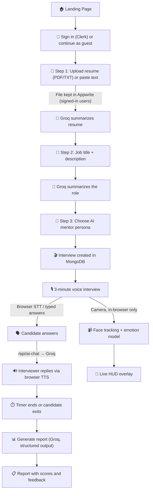

# 🎯 MockMentor — AI-Powered Mock Interview Platform

> Practice real-world interviews with a voice AI interviewer, get live facial-expression analysis that runs entirely in your browser, and receive an honest, detailed performance report.


**Version 2.0** — see [What's new in v2](#-whats-new-in-v2).

---

## 📌 What This Project Does

MockMentor simulates a realistic job interview. A user uploads their resume, enters a job description, picks an AI mentor, and has a timed voice interview with an AI interviewer. While they talk, the browser tracks blinks, gaze, head pose, and facial emotion from the webcam. Afterwards, an AI generates a detailed report with scores, per-question feedback, and concrete recommendations.

**Everything ships as one Next.js app.** There is no separate ML server to deploy: face tracking and the emotion model run in the candidate's browser, and the camera feed never leaves their device.

```text
Candidate's browser                                         Server (Next.js API routes)
─────────────────────────────────────────────               ─────────────────────────────
mic ──► Web Speech API (STT) ──► transcript ───────────────► /api/ai-chat ──► Groq LLM
speaker ◄── Web Speech API (TTS) ◄── interviewer reply ◄────┘
camera ──► MediaPipe face landmarks (10 fps)
             ├─ blink · gaze · head pose · stress/engagement
             └─ face crop ──► emotion model (ONNX, Web Worker, 1×/s)
                                     │
          session summary numbers ───┴──────────────────────► /api/generate-report ──► Groq ──► MongoDB
```

---

## ✨ What's new in v2

- **Trained emotion model in the browser** — HSEmotion `enet_b2_7` (EfficientNet-B2 trained on AffectNet) runs via `onnxruntime-web` in a Web Worker, replacing a hand-tuned rulebook. Verified to match the Python reference implementation within 1e-3.
- **No ML sidecar needed** — the Python service in `model/` is now an optional reference/test harness, not a deployment.
- **Public live demo** at [`/emotion-demo`](#-live-emotion-demo) — anyone can try the emotion model on their own camera.
- **Honest scores** — real per-answer speaking time, pauses, and filler words (including multi-word ones like "you know"); body language is scored only from real camera data and shown as "Not assessed" otherwise; the report is validated against a schema, and if the AI fails you get a retry instead of a made-up report.
- **Working interview flow** — sessions, messages, the timer, and report generation now work end to end for signed-in users and guests.
- **Secured API** — every route checks who owns the interview; the AI chat endpoint builds its prompt on the server and is limited to active interviews; resume uploads are validated before storage.
- **Better live experience** — typed answers (also works in Firefox), a real mute button, a silence nudge, on-screen gaze reminders, and clear camera/microphone error messages.

### Since v2.0 (reliability and safety pass)

- **The server keeps the transcript** — `/api/ai-chat` stores each answer and reply in order; a page refresh restores the interview and repeats the last question.
- **Live interview fixes** — spoken answers are no longer doubled, turning the camera off really turns it off, pause holds, typed answers aren't lost while the interviewer is replying, and the transcript scrolls.
- **Fairer, sturdier reports** — camera stats cover the whole interview, typed answers aren't penalized as silence, the rubric's hard caps are enforced in code, and interviews with no answers aren't sent to the AI.
- **Limits** — per-user and per-IP rate limits on the AI and on new guests, capped input sizes, and one-interview-per-guest checked before any work.
- **Database indexes actually build** — the unique indexes behind "one session / one report per interview" were silently never created.
- **Accessible, phone-friendly UI** — labelled controls, keyboard-friendly mentor picker, light and dark report themes, layouts that fit a 390 px screen.

---

## 🔄 Workflow



### Detailed flow

1. **Sign in** with **Clerk**, or continue as a **guest** (one free interview, no account).
2. **Resume** — upload a PDF or TXT (≤ 5 MB, validated before it's stored in **Appwrite**) or paste text (≤ 20k characters). **Groq** summarizes it; signed-in users get it saved to their profile.
3. **Job details** — a job title and optional description, summarized by **Groq**.
4. **Mentor** — pick an interviewer persona (e.g. a supportive IT mentor, a rigorous tech lead, an HR recruiter).
5. **Interview** — a 3-minute session with a server-side timer (a refresh keeps the clock). The AI interviewer greets the candidate and asks follow-up questions. Answers come from the microphone (**Web Speech API**) or the text box. If the candidate goes silent for ~10 s, the interviewer checks in.
6. **Live analysis** — the webcam feed is analysed in the browser (see below); a HUD shows stress, engagement, attention, and the current emotion.
7. **Report** — the transcript, real speech metrics, and the face-tracking summary go to **Groq**, which returns a schema-validated report saved to MongoDB.

---

## 🧠 Face & Emotion Analysis (in the browser)

| Signal | How | Where |
|---|---|---|
| **Face landmarks** | MediaPipe FaceLandmarker (478 points), GPU with CPU fallback, 10 fps | `hooks/useFaceTracker.ts` |
| **Emotion** (7 classes) | HSEmotion `enet_b2_7` ONNX model via `onnxruntime-web`, in a Web Worker, sampled once per second; falls back to a blendshape heuristic if the model can't load | `lib/emotionModel.ts` |
| **Blinks** | Eye aspect ratio (EAR) with a per-user calibration over the first 90 frames | `lib/faceAnalysis.ts` |
| **Gaze** | Iris offset → "looking at screen" + on-screen reminder banner | `lib/faceAnalysis.ts` |
| **Head pose** | Yaw / pitch / roll from the facial transformation matrix | `lib/faceAnalysis.ts` |
| **Stress, engagement, attention** | Composite scores from the signals above | `lib/faceAnalysis.ts` |

- **Privacy:** frames are never uploaded. Only aggregate numbers (averages, blink rate, time on screen) are saved with the report.
- **First load:** the browser downloads ~44 MB once (the 30 MB emotion model + the ONNX runtime), then caches it. The heuristic covers emotion until it arrives.
- **Not tracked in the browser yet:** hand fidgeting and body posture (the Python reference in `model/` has them).

### 🎥 Live emotion demo

Open **`/emotion-demo`** — a public page (no sign-in) where anyone can turn on their camera and watch the emotion model read their expression live, with a status badge showing whether the trained model or the fallback is running.

---

## 🔑 Environment Variables

| Variable | Service | Used for | Required |
|---|---|---|---|
| `MONGODB_URI` | [MongoDB Atlas](https://www.mongodb.com/atlas) | Users, guests, interviews, sessions, messages, metrics, reports | ✅ |
| `NEXT_PUBLIC_CLERK_PUBLISHABLE_KEY` | [Clerk](https://clerk.com/) | Authentication (client) | ✅ |
| `CLERK_SECRET_KEY` | Clerk | Authentication (server middleware) | ✅ |
| `GROQ_API_KEY` | [Groq](https://groq.com/) | All AI: resume/job summaries, interview conversation, report generation | ✅ |
| `NEXT_PUBLIC_APPWRITE_ENDPOINT` | [Appwrite](https://appwrite.io/) | Resume file storage (signed-in users' latest resume) | For signed-in uploads |
| `NEXT_PUBLIC_APPWRITE_PROJECT_ID` | Appwrite | Your Appwrite project | For signed-in uploads |
| `NEXT_PUBLIC_BUCKET_ID` | Appwrite | Storage bucket for resumes | For signed-in uploads |
| `APPWRITE_API_KEY` | Appwrite | Server-side uploads | For signed-in uploads |
| `NEXT_PUBLIC_SITE_URL` | — | Absolute URL for social preview images | Recommended |
| `GROQ_BASE_URL` | — | Send Groq requests to another OpenAI-compatible URL (a proxy, or a local mock in tests) | No |

No key is needed for face tracking or the emotion model — they run in the browser. Guests' resume files are never stored; only the summary is used.

### Which AI does what?

```text
┌───────────────────────────┬──────────────────────────────────────────────────────┐
│ Groq                      │ Resume + job summaries, welcome message, interview   │
│ gpt-oss-120b → gpt-oss-20b│ follow-ups, report generation (zod-validated output) │
├───────────────────────────┼──────────────────────────────────────────────────────┤
│ Browser Web Speech API    │ Speech-to-text and text-to-speech ($0, no server)    │
├───────────────────────────┼──────────────────────────────────────────────────────┤
│ MediaPipe (browser)       │ Face landmarks, blinks, gaze, head pose              │
├───────────────────────────┼──────────────────────────────────────────────────────┤
│ HSEmotion enet_b2_7       │ 7-class facial emotion, onnxruntime-web (browser)    │
└───────────────────────────┴──────────────────────────────────────────────────────┘
```

---

## 🛠️ Tech Stack

| Layer | Technology |
|---|---|
| **Framework** | Next.js 15 (App Router), React 19, TypeScript |
| **Styling / UI** | Tailwind CSS v4, Radix UI, Lucide icons |
| **Auth** | Clerk (+ guest mode) |
| **Database** | MongoDB Atlas + Mongoose |
| **File storage** | Appwrite |
| **AI / LLM** | Groq via the Vercel AI SDK (`ai` v6), zod structured output |
| **Voice** | Native browser Web Speech API |
| **Computer vision** | MediaPipe Tasks Vision + onnxruntime-web (in the browser) |
| **Tests** | Node's built-in test runner (`node --test`) |

---

## 📁 Project Structure

```text
MockMentor/
├── app/
│   ├── page.tsx                    # Landing page
│   ├── emotion-demo/page.tsx       # Public live demo of the emotion model
│   ├── interview/
│   │   ├── new/page.tsx            # 3-step setup wizard
│   │   └── [id]/page.tsx           # Live interview
│   ├── report/[id]/page.tsx        # Report viewer
│   ├── (dev)/                      # /test-face, /test-speech — dev-only debug pages
│   └── api/
│       ├── auth/guest/             # Create / reuse a guest identity
│       ├── upload-resume/          # Validate + summarize (keeps a signed-in user's latest file)
│       ├── process-resume/         # Summarize pasted resume text
│       ├── process-job/            # Summarize the role
│       ├── create-interview/       # Create interview (atomic guest limit)
│       ├── interview/[id]/         # Fetch interview (auto-closes abandoned ones)
│       ├── interview-session/      # Start (returns the transcript so far) / end
│       ├── ai-chat/                # Interviewer replies; stores the transcript
│       ├── generate-report/        # AI report (503 + retry on failure)
│       ├── report/[id]/            # Read a saved report
│       └── user-profile/           # Signed-in user profile
├── components/
│   ├── interview.tsx               # Interview UI
│   ├── interview-complete.tsx      # Post-interview screen + report generation
│   ├── interview-report.tsx        # Report display
│   ├── interview/StressHUD.tsx     # Live overlay
│   ├── logic/                      # Voice interview state + lifecycle
│   └── ui/                         # Radix UI wrappers
├── hooks/
│   ├── useFaceTracker.ts           # MediaPipe + emotion model loop
│   ├── useSpeechToText.ts          # Browser STT with silence detection
│   └── useTextToSpeech.ts          # Browser TTS
├── lib/
│   ├── emotionModel.ts             # ONNX emotion model (browser)
│   ├── faceAnalysis.ts             # Blink / gaze / pose / stress math
│   ├── speechMetrics.ts            # Real speaking time, WPM, pauses, fillers
│   ├── speechAnswer.ts             # Builds one spoken answer from recognizer events
│   ├── sessionLifecycle.ts         # Closing a session: metrics from the stored transcript
│   ├── reportRules.ts              # Rubric caps enforced after generation
│   ├── rateLimit.ts                # MongoDB-backed rate limits (+ clientIp.ts)
│   ├── inputLimits.ts              # Size limits shared by UI and API
│   ├── reportSchema.ts             # zod schema for AI reports
│   ├── groq.ts                     # Groq client with model fallback
│   ├── requester.ts                # Who is calling + ownership checks
│   ├── prompts.json                # All AI prompts (editable)
│   ├── models/                     # Mongoose schemas
│   └── *.test.ts                   # Unit + parity tests
├── model/                          # Optional Python reference implementation (not deployed)
├── middleware.ts                   # Clerk auth + public routes
└── tasks/todo.md                   # v2 plan, change log, and verification notes
```

---

## 🏃‍♂️ Quick Start

### Prerequisites
- Node.js 22.18+ (CI uses 24; `npm test` runs TypeScript test files directly) and npm
- A MongoDB Atlas cluster, and keys for Clerk, Groq, and Appwrite

### 1. Install

```bash
git clone <repository-url>
cd MockMentor
npm install
```

### 2. Configure

```bash
cp .env.example .env
```

Fill in every variable from the table above.

### 3. Run

```bash
npm run dev
```

Open [http://localhost:3000](http://localhost:3000). Voice works best in Chrome or Edge; in browsers without speech recognition (e.g. Firefox), answer by typing.

### Scripts

| Command | What it does |
|---|---|
| `npm run dev` | Development server |
| `npm run build` / `npm start` | Production build / server |
| `npm run lint` | ESLint |
| `npm run typecheck` | TypeScript (`tsc --noEmit`) |
| `npm test` | Unit tests (`node --test`) |

### Limits

Set in `lib/rateLimit.ts` and `lib/inputLimits.ts` (counters live in MongoDB and expire on their own):

| Limit | Value |
|---|---|
| New guest sessions per IP | 20 / hour |
| AI calls per user or guest | 100 / hour |
| AI calls per IP | 600 / hour (generous, for shared classroom/office IPs) |
| Interviews per signed-in user | 20 / day (guests: 1 in total) |
| Messages per interview | 60 |
| Resume | PDF or TXT, 5 MB, 20,000 characters of text |
| Job title / description | 200 / 10,000 characters |

The client IP is read from `x-real-ip` or the last `x-forwarded-for` entry, which works behind Vercel, Render, or nginx.

---

## 🚀 Deployment

Deploy the Next.js app anywhere that runs Next.js (e.g. Vercel) with the environment variables above. **Nothing else needs to be deployed** — there is no ML service.

> **Before deploying over an existing database:** the unique indexes on `interviewsessions.interviewId` and `interviewreports.interviewId` are now actually created at startup. If older data has duplicates, that index build fails (it's logged; requests keep working). Check with `db.interviewreports.aggregate([{$group:{_id:"$interviewId",n:{$sum:1}}},{$match:{n:{$gt:1}}}])`, and the same for `interviewsessions`.

> `render.yaml` and `model/render.yaml` still describe the old Python sidecar. The app doesn't need it. If you do deploy it, Render generates an `ML_ACCESS_TOKEN`; clients must connect to `/ws/<id>?token=<value>`.

---

## 🐍 Optional: Python reference implementation (`model/`)

`model/` holds the original Python pipeline (FastAPI + MediaPipe + the same ONNX emotion model), kept as a reference and test harness. The app does **not** use it at runtime.

```bash
cd model
python3.11 -m venv .venv && .venv/bin/pip install -r requirements.txt
.venv/bin/python test_pipeline.py   # self-check; also writes the fixture used by the browser parity test
.venv/bin/python test_server.py     # per-connection isolation, access token, bad frames, responsiveness
.venv/bin/python new.py             # local webcam debug viewer (ESC to quit)
```

Model files are downloaded automatically on first run into `model/models/` (gitignored). Outside Docker, MediaPipe needs the GL libraries the `Dockerfile` installs, and `LIBGL_ALWAYS_SOFTWARE=1 MESA_LOADER_DRIVER_OVERRIDE=swrast EGL_PLATFORM=surfaceless` on a machine without a GPU. CI runs both test files, then the browser parity test against their output.

---

## 📊 Report Contents

- **Overall score** (0–100) with an executive summary
- **Performance analysis:** Communication, Technical Knowledge, Problem Solving, Confidence, and Body Language (only when camera data exists — otherwise shown as "Not assessed")
- **Per-question feedback:** the question, your answer, a score, a critique, and suggestions
- **Behavioral insights:** pauses, speech pace, confidence, emotional state
- **Recommendations:** immediate, short-term, and long-term
- **Face analytics summary:** emotion averages, stress, engagement, attention, blink rate

Scores come from a strict rubric in `lib/prompts.json`. If the AI is unavailable, no report is saved and the user can retry — the app never generates a fake report.

---

## 🎨 Customizing AI Prompts

All prompts live in `lib/prompts.json` — resume and job summaries, the interview conversation, and the report rubric. See `lib/PROMPTS_README.md`. Edit the JSON and restart the server; no code changes needed.

---

## 🔮 Future Enhancements

- A desktop app for Windows and Linux (Electron, with local Whisper speech-to-text). The step-by-step build guide is [`DESKTOP_APP_PLAN.md`](DESKTOP_APP_PLAN.md)
- Hand and posture tracking in the browser
- A smaller (int8-quantized) emotion model for faster first loads, and self-hosting the model file
- Streaming AI replies, and Whisper speech-to-text for all browsers
- Interview history and progress dashboard
- Configurable interview length and industry-specific modules
- PDF export of reports

---

**Built for NexHack by Team Algorhythm** 🚀

---

## 🎯 Interview Prep — Key Files to Study

| Priority | File | Why it matters |
|---|---|---|
| **1** | `hooks/useFaceTracker.ts` + `lib/emotionModel.ts` | In-browser CV pipeline: MediaPipe, periodic emotion sampling, Web Worker inference, graceful fallback |
| **2** | `lib/emotionModel.test.ts` + `model/test_pipeline.py` | How the browser model is proven to match the Python reference on labelled faces |
| **3** | `hooks/useSpeechToText.ts` | Browser STT with pause detection, a total-silence watchdog, and real per-answer timing |
| **4** | `app/api/ai-chat/route.ts` | Server-built prompts, the server-kept transcript, ownership + time-window checks, rate limits, honest failure handling |
| **5** | `app/api/generate-report/route.ts` + `lib/reportSchema.ts` | Structured, schema-validated reports; 503 instead of a fabricated fallback |
| **6** | `lib/requester.ts` | One place for identity and ownership (users and guests) |
| **7** | `lib/prompts.json` | AI behavior decoupled from code — personas and the scoring rubric |
| **8** | `lib/speechMetrics.ts` | Real speaking time, WPM, pauses, and filler-word counting |
| **9** | `lib/reportRules.ts` + `lib/rateLimit.ts` | Rubric caps enforced in code; MongoDB-backed rate limits |

> Notes in `docs/` are historical and partly describe the v1 architecture (Gemini, the Render sidecar). `tasks/todo.md` is the up-to-date record of the v2 changes.

### One-liner pitch
> "MockMentor is an AI mock-interview platform built as a single Next.js app: the browser handles voice (Web Speech API) and computer vision (MediaPipe + an ONNX emotion model in a Web Worker), so video never leaves the device; Groq powers the interviewer and a schema-validated, strictly scored report; MongoDB stores sessions and reports."

### Top 3 talking points
1. **Privacy-first, zero-infra CV** — moving the ML pipeline from a Python sidecar into the browser removed a server, its cost, and the need to upload video.
2. **Verified, not assumed** — the browser model is tested for numerical parity with the Python reference on labelled faces.
3. **Honest output** — real metrics, "Not assessed" instead of guessed scores, and retries instead of fabricated reports.
